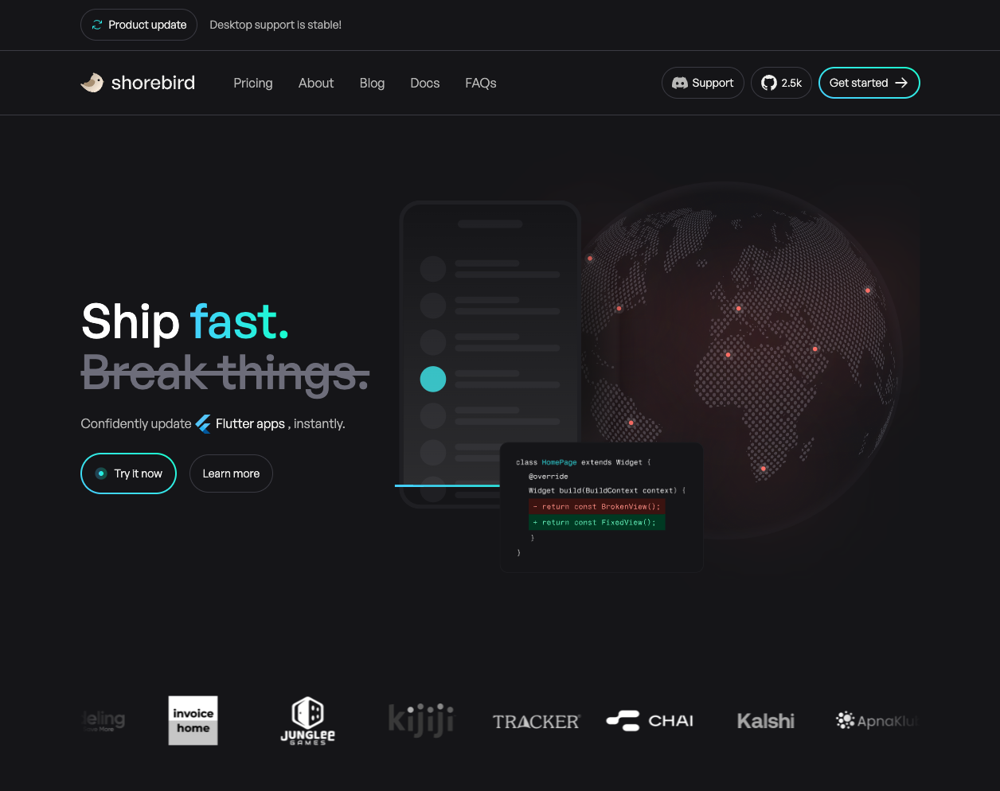
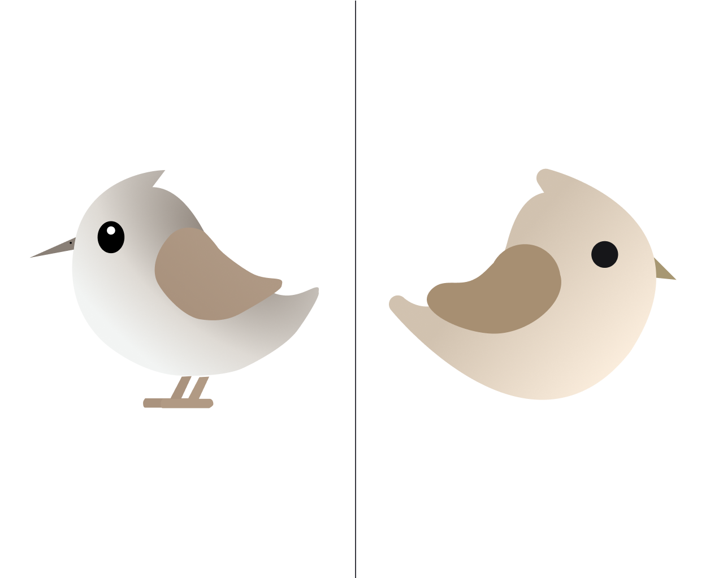
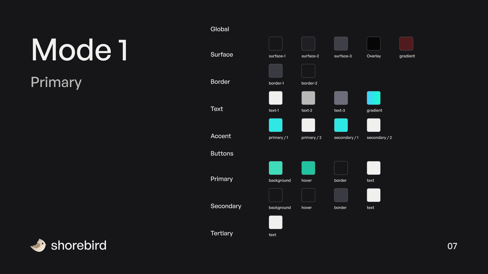

<!-- cspell:ignore Enuma  -->

Shorebird has been around for just over 2 years and we felt it was time for a
much-needed brand refresh!

### Redesigned Website

We're super excited to announce the next iteration of
[shorebird.dev](https://shorebird.dev) 🥳

Our previous site was very minimal and tailored specifically for developers. One
of our main goals for the site redesign was to clearly (and visually)
communicate the value of Shorebird's solutions to both developers and
non-technical folks.

### Brand Refresh

We also took this as an opportunity to refresh our logo. Our goal was to polish
and simplify where possible while still maintaining the cute, playful sandpiper.

_Fun Fact: Did you know the name Shorebird is the name of the street on which
Flutter was created?_

 _Old Logo
(left), Refreshed Logo (right)_

We also revisited and adjusted our core brand assets including our typography,
color palette, and more.

### Conclusion

With a primary focus on making Shorebird more accessible to technical and
non-technical folks alike, this redesign includes:

- Updated Typography
- Updated Color Palette
- Refreshed Logo
- Redesigned Website
- Social assets
- And more...

We'd love to hear your thoughts on the refresh! If you'd like to give feedback,
ask questions, or just say hi you can reach us on
[Discord](https://discord.gg/shorebird).

A huge thank you to [Enuma](https://www.enuma-collective.com) for helping make
this redesign a reality 💙
