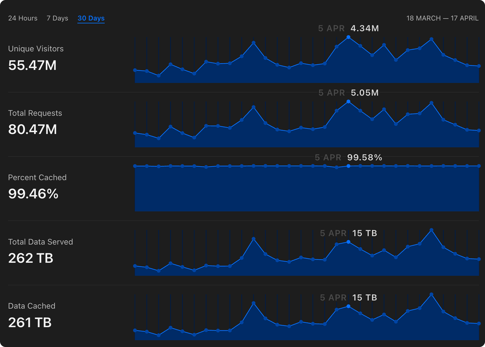
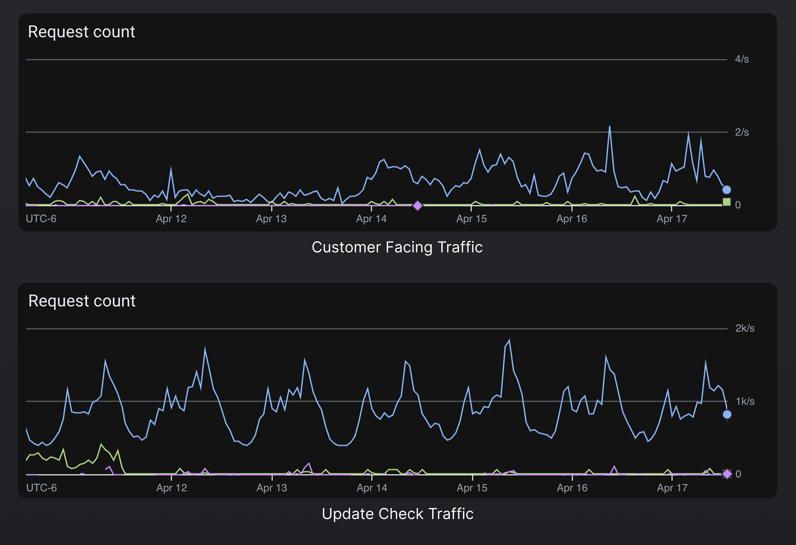
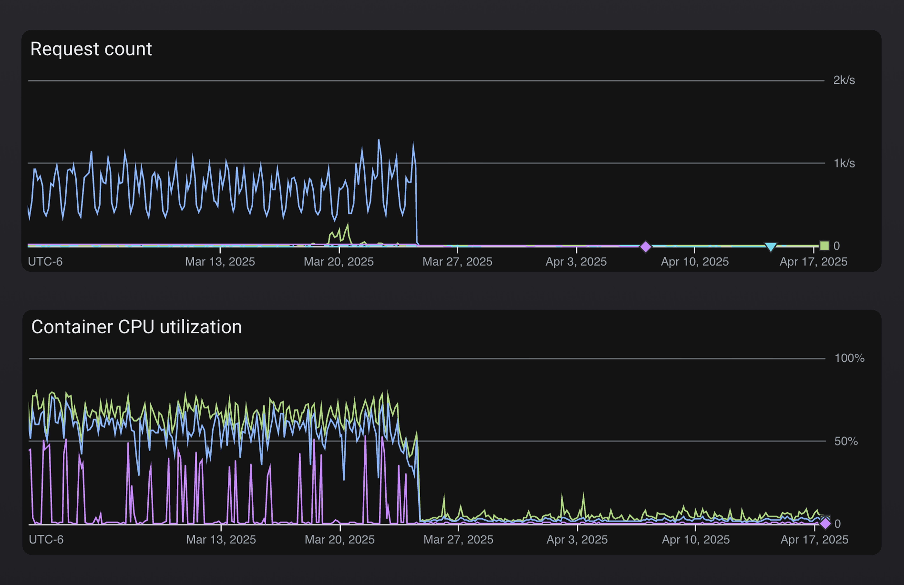
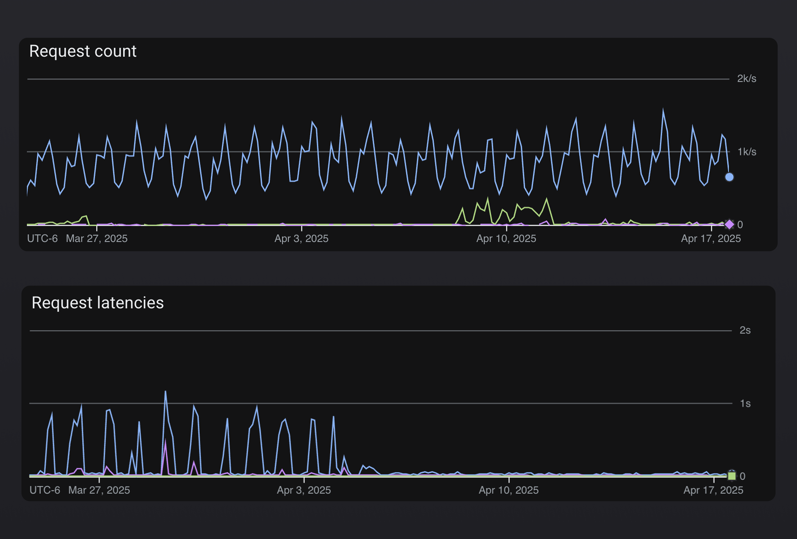
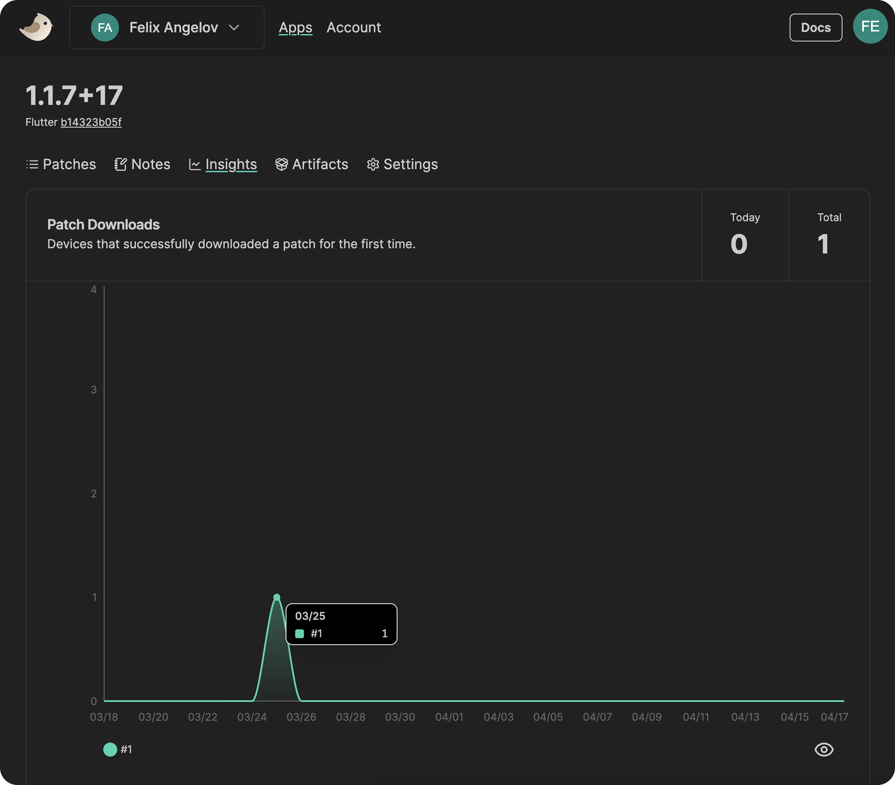
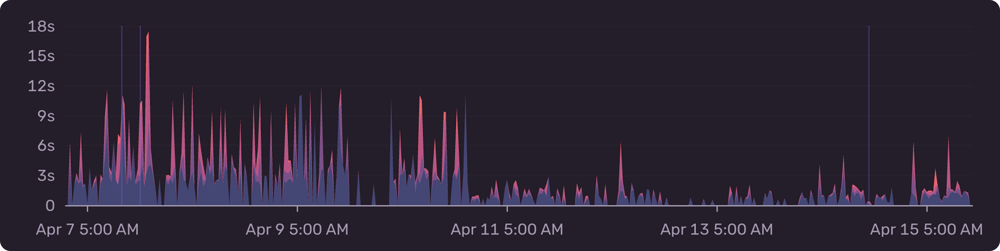

Over the last few months we've experienced a lot of growth at Shorebird! Just in
the last 30 days, we've served over 80 million patches to users' devices
worldwide 🚀

As the number of devices and users that depend on Shorebird continued to grow,
we started to notice some bottlenecks in our backend infrastructure that weren't
optimized for the current (and projected) scale. We knew that we needed to
invest in various backend improvements to continue to provide the same level of
reliability and low latency to our rapidly growing user base.

In this blog, I want to talk about some of the learnings and improvements we've
made to ensure our cloud infrastructure continues to grow and scale with our
user base while reliably delivering millions of patches all over the world 🌎

## Decoupling Services

One of the first improvements we made was to decouple the APIs that our
customers directly interact with (via the Shorebird CLI and console) from the
APIs that devices interact with (via the Shorebird updater). As you can imagine,
the endpoints that are consumed by devices via the Shorebird updater experience
much higher load than the endpoints that power the console and CLI. Millions of
devices worldwide are constantly checking for new patches whereas our console
and CLI usage is orders of magnitude lower.

Just to give you a sense of the discrepancy, over the last 2 weeks, the update
check endpoints received ~1k reqs/sec whereas customer facing endpoints received
~0.5 reqs/sec. Furthermore, the traffic to our updater endpoints is very bursty
in nature, we normally see rapid spikes of up to 10k req/sec for a period of
several minutes, whereas traffic to customer facing APIs is relatively consistent.

We were able to gracefully decouple the two services without any downtime or
outages with the help of external application load balancers and some benefits
we immediately noticed included:

- Reduced blast radius: any performance degredation in update check endpoints
  would not affect the customer facing services and vice-versa
- Reduced costs: we were able to cut costs by selectively upgrading hardware and
  scaling for updater facing services
- Improved visibility: monitoring and alerting was much easier because we were
  able to have more granualar alerts and health checks for each service

You can clearly see the difference in request volume and CPU usage of our
customer facing services before and after we decoupled them from the updater
services.

## Removing Computations from Hot Paths

Once we had split out the updater endpoints from the customer facing endpoints
it became clear that we still had some work to do in terms of optimizing
response times for patch checks. We already had a layer of caching in place but
it wasn't enough at the current scale. Our patch check service was frequently
having to invalidate the cache and perform expensive comutations to determine
things like whether an account had exceeded the patch install limit for the
respective billing period or what the latest available patch was for a given
app.

We removed all of this logic from the updater service and relied on background
processes to compute and cache all necessary information. Our revamped setup
consisted of real-time logs being aggregated, a message being sent to a pub/sub
topic, and various subscribers performing the expensive computations
asynchronously and caching the results for the patch check service to consume
directly.

This dramatically reduced the latency and overall compute needed per update check
request. We went from requests occasionally taking >1s during sudden spikes in
request volume to 99% of our request completing in <300ms.

## Introducing a Time Series Database

The last major area I want to touch on is our insights tab within the Shorebird
console. It was responsible for surfacing graphs of patch install and download
usage over time.

Originally, this information was being queried on-demand directly from BigQuery
which we quickly learned was not going to scale. BigQuery is designed for batch
processing of large amounts of data via scheduled jobs -- not for low latency
lookups of time series data.

Similar to our caching improvements above, we leveraged a pub/sub topic and
various subscriptions to aggregate and write patch metrics to a dedicated time
series database asynchronously. This meant we were able to completely remove
BigQuery as a runtime dependency from our system and drastically improved
reliability and performance of our patch insights in addition to other parts of
our system (e.g. the account page, usage reporting jobs, and more).

By moving to using a dedicated time series database for patch metrics, we
reduced pageload time by up to 10x.

We also adjusted all other jobs which previously read directly from BigQuery to
instead query the time series database and observed significant improvements
in the time to complete each job.

| Job             |   Before   |   After   |
| --------------- | :--------: | :-------: |
| Usage Reporting | 10 minutes | 3 minutes |
| Email Alerting  | 30 minutes | 8 minutes |

## Get Started

That's all for now!

These infrastructure improvements are already rolled out to all Shorebird
customers around the world. 🥳

If you're new to Shorebird and want to get started, head over to the [Shorebird
Console](https://console.shorebird.dev).
