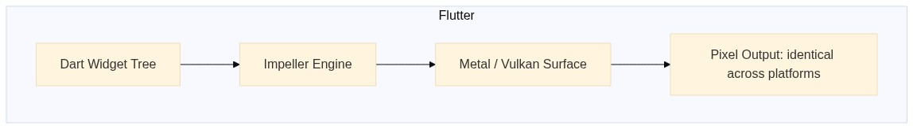
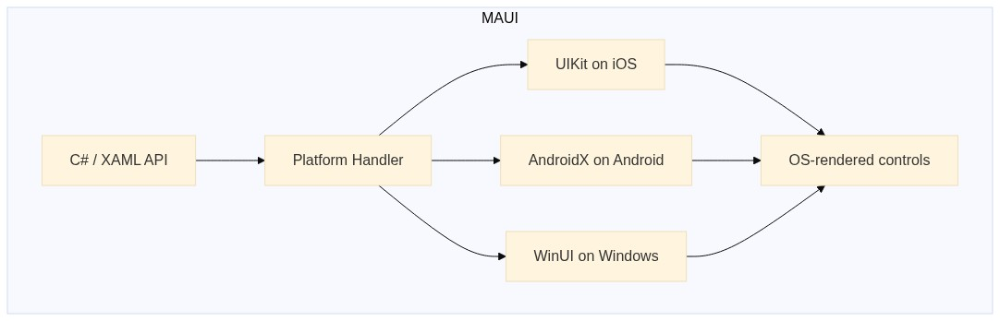

---
title:
  'Flutter vs .NET MAUI: Architecture, tooling, and deployment trade-offs that
  actually matter in 2026'
author: shorebirdtech
description:
  A clear look at Flutter vs .NET MAUI and the trade-offs that affect how your
  team builds and ships.
date: 2026-04-01
cover: flutter-vs-dotnet-maui-architecture-tooling-deployment.png
intro:
  A clear look at Flutter vs .NET MAUI and the trade-offs that affect how your
  team builds and ships.
readingTime: 9 min read
ogImage: '/blog/og/flutter-vs-dotnet-maui-architecture-tooling-deployment.jpg'
seoTitle: 'Flutter vs .NET MAUI in 2026: Architecture & Tooling'
seoDescription:
  Compare Flutter vs .NET MAUI in 2026 across architecture, tooling, CI/CD, and
  migration from Xamarin. Learn which framework fits your team and production
  needs.
---

<!-- Converted from the Webflow CMS export by scripts/import_webflow.py -->

[Xamarin reached end-of-life on May 1, 2024](https://dotnet.microsoft.com/en-us/platform/support/policy/xamarin).
If you’re running Xamarin.Forms or Xamarin.iOS/Android in production, the
maintenance window has closed. The default assumption at most .NET shops is that
.NET MAUI is the obvious migration target, and for many teams it is. But the
question of whether to migrate to MAUI or rewrite in Flutter carries real
consequences for your team’s tooling experience, CI pipeline structure, and
ability to ship fixes post-launch.

This article covers the Flutter vs. .NET MAUI trade-offs that actually drive
outcomes: how each framework’s rendering architecture behaves under real-world
UI demands, where each toolchain breaks down, how the CI/CD story differs, and
what long-term dependency risk looks like for both. If you know what a platform
channel is and you’ve configured a build flavor, you’re the target reader.

## Why the Flutter vs. .NET MAUI Comparison Is Worth Revisiting in 2026

The Xamarin EOL date creates an immediate forcing function. Teams with
meaningful Xamarin codebases have to move, and the first question is whether the
path leads to MAUI or somewhere else entirely. Beyond the migration pressure,
both frameworks have changed enough since their last serious comparison that
most published analyses are working from outdated data.

On the MAUI side, the stability issues that plagued the .NET 6 release cycle are
largely resolved. By .NET 8, MAUI is a credible production option.
[Microsoft’s official .NET support policy](https://dotnet.microsoft.com/en-us/platform/support/policy/maui)
puts .NET 9 (shipped November 2024) and .NET 10 (LTS, November 2025) as the next
two milestones, both with targeted MAUI improvements.

On the Flutter side, [Impeller](https://docs.flutter.dev/perf/impeller) is the
default renderer on iOS as of Flutter 3.22, replacing Skia.
[Dart 3](https://dart.dev/language) enforced null safety ecosystem-wide.
WebAssembly is in preview as a build target. The platform surface has grown
materially since the last wave of Flutter vs. MAUI comparisons.

## Rendering Architecture: How Flutter and MAUI Handle the Pixel Pipeline

Flutter and MAUI take architecturally opposite approaches to rendering, and that
difference compounds across every UI requirement in your app.



_Flutter rendering pipeline_

Flutter’s rendering pipeline runs end-to-end within the framework. Dart code
describes the widget tree, which compiles to a scene, which Impeller rasterizes
directly onto a GPU surface (Metal on iOS, Vulkan on Android). The pixels on
screen are Flutter’s output, produced entirely within the framework’s own
rendering pipeline.



_MAUI rendering pipeline_

MAUI maps a shared C# API surface to platform-native controls. A `<Button>` in
MAUI XAML becomes a `UIButton` on iOS, a `MaterialButton` on Android, and a
WinUI `Button` on Windows. The OS renders each control, and MAUI coordinates the
abstraction layer on top.

The practical consequence shows up most clearly in animation. Flutter’s
`AnimatedContainer` produces deterministic output because Impeller
[compiles Metal/Vulkan shaders at build time](https://docs.flutter.dev/perf/impeller#:~:text=Impeller%20precompiles%20a%20smaller%2C%20simpler%20set%20of%20shaders%20at%20engine%2Dbuild%20time%20so%20they%20don%27t%20compile%20at%20runtime),
which eliminated the runtime shader compilation jank that hit Skia on first
render:

```dart
AnimatedContainer(
  duration: const Duration(milliseconds: 300),
  curve: Curves.easeInOut,
  width: expanded ? 200.0 : 100.0,
  decoration: BoxDecoration(
    color: expanded ? Colors.blue : Colors.grey,
    borderRadius: BorderRadius.circular(8.0),
  ),
)
```

The equivalent MAUI animation delegates rendering to the platform:

```dart
await container.AnimateTo(200, 300, Easing.SinInOut);
container.BackgroundColor = Colors.Blue;
```

Both snippets look simple, but Flutter’s output is identical on iOS 16 and
iOS 17. The MAUI version’s visual output depends on the UIKit animation stack in
the running iOS version, and Apple has changed UIKit rendering behavior across
major versions. Impeller also targets 120Hz displays on ProMotion-capable iOS
devices through a single `targetFrameRate: 120` call in your app’s main loop.
Achieving the same with Skia required per-platform configuration.

If your app must match the platform’s native look on each OS, MAUI’s approach is
the correct one. Enterprise line-of-business apps on Windows that need to feel
like WinUI, or iOS apps with deep UIKit integration requirements, are legitimate
MAUI use cases. Flutter’s pixel-identical consistency becomes a liability when
your users expect platform-native UX.

## Language, Ecosystem, and Hiring Reality

Syntax comparisons between Dart and C# are mostly irrelevant at a senior level.
What matters operationally is type system behavior, package ecosystem health,
and onboarding velocity.

[Dart 3](https://dart.dev/language/type-system) enforces sound null safety
across the entire [pub.dev](https://pub.dev/) ecosystem. Every package that
predated Dart 3 had to migrate before publishing under Dart 3-compatible version
constraints, which means you’ll hit a null-safety violation at compile time
rather than at runtime on a user’s device. C# gained nullable reference types in
[C# 8.0 (2019)](https://learn.microsoft.com/en-us/dotnet/csharp/whats-new/csharp-8#nullable-reference-types),
but opt-in migration means legacy codebases still carry paths where
`NullReferenceException` is a runtime risk.

| Dimension                 | Flutter / pub.dev                                                                  | .NET MAUI / NuGet                                                                          |
| ------------------------- | ---------------------------------------------------------------------------------- | ------------------------------------------------------------------------------------------ |
| Package count             | ~65,000+ (Flutter-focused)                                                         | ~475,000 (broad .NET ecosystem)                                                            |
| Mobile-optimized packages | Camera, maps, BLE, and push notification packages are mature and production-tested | Growing, but many NuGet packages have desktop-centric APIs that require mobile abstraction |
| Type safety               | Sound null safety, compile-time enforced ecosystem-wide since Dart 3               | Nullable reference types since C# 8; opt-in migration, legacy code paths persist           |
| Language onboarding       | 2-4 weeks for engineers with Java or TypeScript backgrounds                        | Minimal for existing C# teams                                                              |
| Web code reuse            | Dart for web (limited ecosystem)                                                   | Blazor Hybrid: embed and share existing Blazor components directly in the native app       |

The
[Blazor Hybrid](https://learn.microsoft.com/en-us/aspnet/core/blazor/hybrid/)
story is a genuine MAUI differentiator. If your organization runs Blazor web
components, MAUI lets you embed and share them directly in the native app shell,
and that’s real code reuse for teams with existing Blazor investment.

[pub.dev](https://pub.dev/)’s Flutter focus is an advantage for mobile work:
camera, maps, Bluetooth, and push notification plugins are production-tested
across a wide range of device configurations. [NuGet](https://www.nuget.org/)’s
size advantage matters less in a mobile context because the majority of those
~500,000 packages target .NET’s server and desktop runtimes. On hiring, C#
developers significantly outnumber Dart developers globally, but Dart’s learning
curve for engineers with Java or TypeScript experience keeps this a 2-4 week
onboarding question for most teams.

## Flutter vs. .NET MAUI Tooling: Where the Day-to-Day Experience Diverges

[Flutter DevTools](https://docs.flutter.dev/tools/devtools/overview) is
browser-based and IDE-agnostic. The timeline view, memory allocation graphs,
network request inspection, widget rebuild counts, and performance overlay all
work identically regardless of whether you’re on VS Code, Android Studio, or a
bare terminal. Running `flutter run --profile` outputs a DevTools URL you open
in any browser:

```sh
$ flutter run --profile
An Observatory debugger and profiler on iPhone 15 Pro is available at:
  http://127.0.0.1:50950/...
The Flutter DevTools debugger and profiler on iPhone 15 Pro is available at:
  http://127.0.0.1:9102?uri=http://127.0.0.1:50950/...

```

From that URL you get the full profiler: frame timeline, heap snapshots, and
network tab. For teams with mixed Windows/Mac developers, the debugging
experience is genuinely uniform across both machines.

MAUI’s tooling story has a structural problem that Mac developers hit
immediately.
[Microsoft discontinued Visual Studio for Mac in August 2024](https://devblogs.microsoft.com/visualstudio/visual-studio-for-mac-retirement-announcement/),
and the current Mac MAUI experience is VS Code with the
[.NET MAUI extension](https://marketplace.visualstudio.com/items?itemName=ms-dotnettools.dotnet-maui).
That extension provides no XAML IntelliSense parity with Visual Studio on
Windows, has limited Hot Reload support for complex data binding contexts, and
lacks integrated iOS simulator control. If your team includes Mac-based
developers, this is a real productivity delta with no short-term resolution on
Microsoft’s published roadmap.

On Windows with Visual Studio 2022, MAUI’s experience is strong. XAML Hot
Reload, MAUI Hot Restart, and the multi-platform debugger work well together,
and the IDE integration is genuinely competitive.

Flutter’s stateful Hot Reload preserves widget state across most Dart code
changes because the state is held in Flutter’s own widget tree, independent of
the OS. MAUI’s
[XAML Hot Reload](https://learn.microsoft.com/en-us/dotnet/maui/xaml/hot-reload)
handles layout changes reliably but has documented edge cases with complex data
binding contexts and custom renderer code. When your app uses a custom renderer
for a third-party map SDK, MAUI Hot Reload often forces a full restart. Flutter
DevTools’ widget inspector goes further than most teams use it: it shows rebuild
counts per widget per frame, which makes isolating unnecessary rebuilds in a
`ListView` with expensive children a five-minute diagnostic job.

## CI/CD Pipelines for Flutter vs. .NET MAUI: Where the Delta Is Largest

Flutter’s CLI is build-system agnostic. `flutter test`,
`flutter build apk --release`, and `flutter build ipa` run on any Linux, macOS,
or Windows CI agent with no IDE dependency. The agent needs Flutter installed,
and setup ends there:

```yaml
# Flutter: Linux handles Android; macOS handles iOS
name: Flutter CI
on: [push, pull_request]
jobs:
  test-and-build-android:
    runs-on: ubuntu-latest
    steps:
      - uses: actions/checkout@v4
      - uses: subosito/flutter-action@v2
        with:
          flutter-version: '3.x'
      - run: flutter test
      - run: flutter build apk --release

  build-ios:
    runs-on: macos-latest
    steps:
      - uses: actions/checkout@v4
      - uses: subosito/flutter-action@v2
        with:
          flutter-version: '3.x'
      - run: flutter build ipa --no-codesign
```

MAUI builds are coupled to the
[.NET SDK](https://dotnet.microsoft.com/en-us/download) and MSBuild. Android
targets build on Linux or Windows agents, iOS targets require macOS (Xcode
signing requirements apply regardless of framework), and WinUI targets require
Windows. A multi-platform MAUI CI setup needs three separate agent
configurations:

```yaml
# MAUI: three separate agent pools required
name: MAUI CI
on: [push, pull_request]
jobs:
  build-android:
    runs-on: ubuntu-latest
    steps:
      - uses: actions/checkout@v4
      - uses: actions/setup-dotnet@v4
        with:
          dotnet-version: '9.x'
      - run: dotnet workload restore
      - run: dotnet build src/MyApp.csproj -f net9.0-android -c Release

  build-ios:
    runs-on: macos-latest
    steps:
      - uses: actions/checkout@v4
      - uses: actions/setup-dotnet@v4
        with:
          dotnet-version: '9.x'
      - run: dotnet workload restore
      - run: dotnet build src/MyApp.csproj -f net9.0-ios -c Release

  build-windows:
    runs-on: windows-latest
    steps:
      - uses: actions/checkout@v4
      - uses: actions/setup-dotnet@v4
        with:
          dotnet-version: '9.x'
      - run: dotnet workload restore
      - run:
          dotnet build src/MyApp.csproj -f net9.0-windows10.0.19041.0 -c Release
```

The agent requirement delta compounds as the team grows. MAUI teams pay for
macOS and Windows build minutes separately, or maintain multiple self-hosted
runner pools.

The most operationally significant difference between the two frameworks is OTA
update capability. Flutter supports over-the-air Dart code updates via
[Shorebird CodePush](https://docs.shorebird.dev/), which patches the compiled
Dart bytecode on end-user devices without an app store submission. For a
critical bug in production, this is the difference between an immediate fix and
a 24-48 hour review cycle that can stretch over a weekend. MAUI has no
equivalent first-class mechanism for pushing native code updates to production
without store review.

[Shorebird CodePush](https://docs.shorebird.dev/) patches Dart bytecode
incrementally, downloading only the changed code. PushPress’s senior mobile
developer Allan Wright reported that their release turnaround dropped from a
range of four days to two weeks down to hours. MAUI teams shipping a critical
hotfix must go through the full
[App Store review cycle](https://developer.apple.com/app-store/review/) each
time.

For CI specifically,
[Shorebird CI](https://shorebird.dev/blog/introducing-shorebird-ci/) is
purpose-built for Flutter and Dart monorepos. It runs checks only on packages
affected by a given change, uses dependency-aware parallelism, and eliminates
the need to maintain complex YAML configurations. The
[Flame engine](https://flame-engine.org/) project completed CI checks in
approximately 20 seconds on unchanged code paths with Shorebird CI, cutting
total CI time by 50% compared to generic GitHub Actions. For Flutter monorepos
where build times are climbing, that’s a concrete and measurable improvement.

## Long-Term Risk and Technical Debt: Flutter vs. MAUI

Xamarin is the right example for evaluating framework longevity risk. It was
Microsoft-backed, enterprise-adopted, and production-used for years, and it
still
[reached EOL on May 1, 2024](https://dotnet.microsoft.com/en-us/platform/support/policy/xamarin)
on a timeline that forced meaningful migration work. That history makes explicit
longevity analysis worth doing for both frameworks.

MAUI’s risk profile is low for .NET shops. It ships on the annual .NET release
cadence, carries an LTS release in .NET 10, and is backed by the
[.NET Foundation](https://dotnetfoundation.org/). The .NET ecosystem has
navigated multiple major runtime transitions without stranding production
codebases.

Flutter’s risk profile is worth examining honestly: Google backs the framework,
but [Dart](https://dart.dev/) has narrow use outside of Flutter, and Google’s
history with product deprecations is a documented risk factor. The case for
Flutter’s longevity rests on a consistent release cadence since 2018 with no
framework-level deprecations, a
[public roadmap on GitHub](https://github.com/flutter/flutter/blob/master/docs/roadmap/Roadmap.md)
with measurable delivery against milestones, and Flutter’s presence in gaming
and embedded development, which broadens its ecosystem dependencies beyond
mobile alone.

Technical debt accumulates differently depending on which framework you choose.
Flutter’s custom rendering pipeline means OS UI updates require the Flutter team
to ship support before your app benefits. When Apple introduces a new Dynamic
Island interaction or Android ships a new dynamic color API, Flutter teams wait
on Flutter’s release cycle to pick it up. MAUI’s native controls inherit OS
changes automatically, but they also inherit OS rendering inconsistencies and
breaking API changes. Both create maintenance work, though the trigger differs.

One concrete signal worth tracking: commit frequency on both
[Flutter’s GitHub repo](https://github.com/flutter/flutter) and
[MAUI’s GitHub repo](https://github.com/dotnet/maui), issue triage latency, and
the maintenance health of critical community packages on
[pub.dev](https://pub.dev/) vs. [NuGet](https://www.nuget.org/). Both frameworks
show healthy activity in 2025, but MAUI community package depth is newer and
shallower relative to Flutter’s, which reflects the earlier start Flutter had in
building a mobile-first ecosystem.

## Decision Framework: Flutter or .NET MAUI?

The choice between Flutter and MAUI maps cleanly to a few concrete conditions:

| Condition                                                                      | Choose Flutter | Choose .NET MAUI |
| ------------------------------------------------------------------------------ | -------------- | ---------------- |
| Cross-platform UI consistency is a product requirement                         | Yes            |                  |
| App has complex animations, custom graphics, or game-like interactions         | Yes            |                  |
| Team can onboard to Dart in 2-4 weeks                                          | Yes            |                  |
| OTA update capability matters for your release cadence                         | Yes            |                  |
| Existing backend is outside the .NET ecosystem                                 | Yes            |                  |
| Team is primarily C# and a language switch would cost significant productivity |                | Yes              |
| App integrates with Azure AD, Azure services, or an existing .NET backend      |                | Yes              |
| Blazor Hybrid code reuse with an existing web app is a real requirement        |                | Yes              |
| App must use platform-native controls and feel indistinguishable on each OS    |                | Yes              |

The Xamarin migration question has its own answer. MAUI is the direct migration
path.
[Microsoft publishes migration guides](https://learn.microsoft.com/en-us/dotnet/maui/migration/),
the API surface maps closely, and existing C# business logic carries over. A
Flutter migration is a full rewrite with no tooling-assisted path. For apps with
heavy platform-specific code or mature C# business logic layers, MAUI migration
is the lower-risk choice. A Flutter rewrite makes sense when the existing app
has UX debt that MAUI’s native control architecture can’t address, or when the
team is willing to trade short-term migration cost for Flutter’s deployment and
tooling advantages over a longer horizon.

If you’re going with Flutter, audit your deployment pipeline before your first
post-launch bug. The standard
[App Store review cycle](https://developer.apple.com/app-store/review/) runs
24-48 hours under normal conditions and can stretch over a weekend. Add
[Shorebird CodePush](https://docs.shorebird.dev/) to your staging environment
this sprint. Setup takes under 30 minutes, the integration validates cleanly
before you need it under pressure, and the docs at
[docs.shorebird.dev](https://docs.shorebird.dev/) walk through it end to end.

If your CI is running Flutter checks through generic GitHub Actions and build
times are climbing,
[Shorebird CI](https://shorebird.dev/blog/introducing-shorebird-ci/) is worth
evaluating. The Flame engine project saw CI time drop by 50%, with unchanged
code paths completing in approximately 20 seconds.

## Frequently Asked Questions: Flutter vs. .NET MAUI

### Should I migrate from Xamarin to Flutter or .NET MAUI?

For most teams, MAUI is the lower-risk Xamarin migration target.
[Microsoft provides official migration guides](https://learn.microsoft.com/en-us/dotnet/maui/migration/),
the C# API surface maps closely, and existing business logic carries over
without a rewrite. Flutter is the better choice only if you have significant UX
debt the MAUI architecture can’t address, or if OTA deployment capability is a
hard requirement.

### Does Flutter or .NET MAUI have better CI/CD support?

Flutter’s CLI-first toolchain is simpler to integrate into CI. Android and iOS
builds run on two agent types (Linux and macOS), and tools like
[Shorebird CI](https://shorebird.dev/blog/introducing-shorebird-ci/) add
dependency-aware parallelism for monorepos. MAUI requires three separate agent
pools, Linux for Android, macOS for iOS, and Windows for WinUI, which increases
pipeline complexity and cloud build costs.

### Can Flutter apps be updated without going through the App Store?

Yes. [Shorebird CodePush](https://docs.shorebird.dev/) patches compiled Dart
bytecode on end-user devices without an app store submission. This allows
critical bug fixes to reach users in hours, bypassing the 24-48 hour
[App Store review](https://developer.apple.com/app-store/review/) window. .NET
MAUI has no equivalent first-class OTA update mechanism.

### Is Flutter or .NET MAUI better for animation performance?

Flutter’s [Impeller renderer](https://docs.flutter.dev/perf/impeller) compiles
shaders at build time, eliminating the first-frame jank that affected Skia.
Animation output is deterministic across iOS and Android versions. MAUI
delegates rendering to platform-native controls, which means performance
characteristics vary by OS version, but it also means ProMotion and system-level
rendering improvements are inherited automatically.

### Which framework has better Mac developer tooling in 2026?

Flutter wins here by a significant margin. Flutter DevTools is browser-based and
fully functional on macOS.
[Microsoft discontinued Visual Studio for Mac in August 2024](https://devblogs.microsoft.com/visualstudio/visual-studio-for-mac-retirement-announcement/),
leaving MAUI Mac developers with a VS Code extension that lacks XAML
IntelliSense parity and has limited Hot Reload support.

If you’re running Flutter in production and a critical bug requires an app store
submission, you’re already behind. Add Shorebird CodePush to your release
pipeline before you need it. Setup takes under 30 minutes.
[Get started at docs.shorebird.dev](https://docs.shorebird.dev/)
