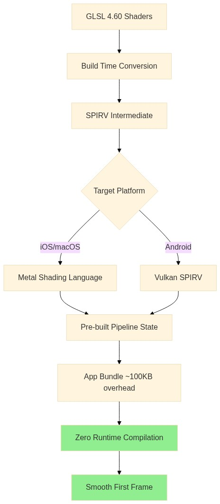
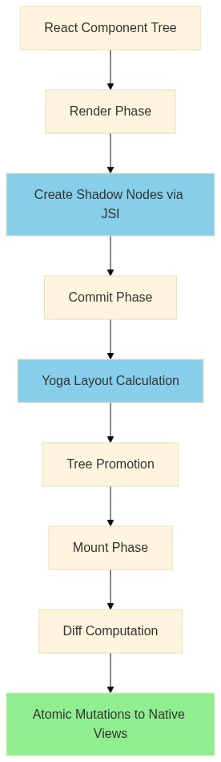
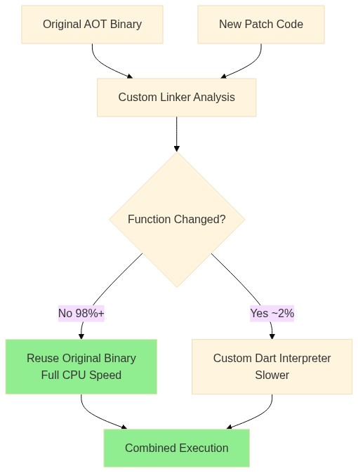
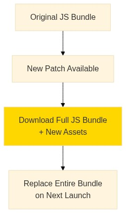
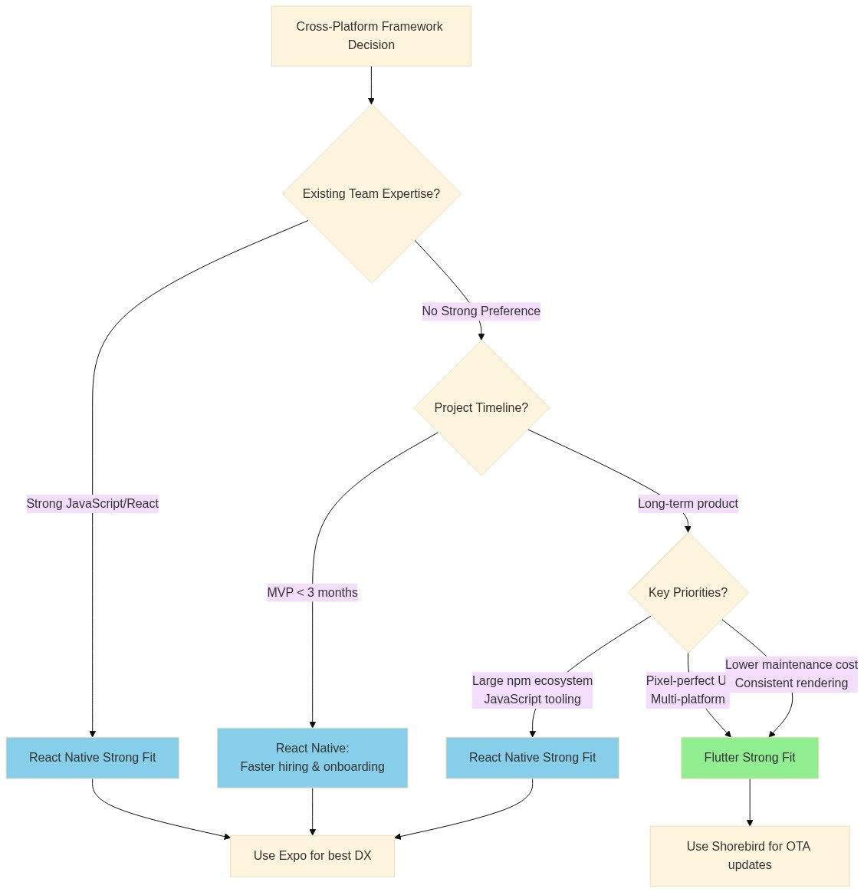

<!-- Converted from the Webflow CMS export by scripts/import_webflow.py -->

Flutter’s Impeller renderer and React Native’s New Architecture represent major
architectural shifts, but they solve very different historical problems.
Impeller was introduced primarily to address shader compilation jank on iOS,
where Apple’s move to out-of-process shader compilation made Skia’s just-in-time
shader model increasingly expensive during app startup. Native Swift apps were
unaffected because their shaders were already compiled ahead of time. Flutter,
despite using a relatively fixed shader set, still paid the runtime cost.
Impeller moved shader compilation to build time, eliminating that class of
startup stutter on iOS.

React Native’s New Architecture tackles a different bottleneck. By replacing the
legacy bridge with JSI’s synchronous C++ interface, it removes the serialization
overhead that previously constrained performance and concurrency. Together,
these changes narrow the historical performance gap between the two frameworks,
but through fundamentally different strategies.

For CTOs weighing these frameworks, the decision hinges on architectural
trade-offs: Flutter offers pixel-perfect consistency and 20% lower long-term
maintenance, while React Native provides access to the JavaScript talent pool
that’s _20x larger_ and faster MVP development with existing React teams.

Both frameworks have matured substantially, React Native 0.76+ made the
[New Architecture default](https://reactnative.dev/blog/2024/10/23/the-new-architecture-is-here)
in October 2024, and Flutter’s Impeller became mandatory on iOS in
[Flutter 3.29](https://docs.flutter.dev/perf/impeller#ios). The performance gap
has narrowed significantly, with React Native achieving 92-99% latency reduction
in native module calls through JSI. However, Flutter delivers consistent
performance advantages, including faster startup times, smooth 60fps rendering
with zero jank in optimized scenarios on iOS, and efficient memory usage during
intensive tasks.

## Impeller eliminates Flutter’s historic shader jank problem

Flutter’s custom
[rendering engine Impeller](https://docs.flutter.dev/perf/impeller) represents a
ground-up solution to shader compilation jank, the notorious first-run
stuttering that plagued Flutter apps for years. With [Skia](https://skia.org/)
(the previous renderer), encountering new draw command sequences triggered
runtime shader compilation requiring 100-300+ milliseconds, exceeding the 16ms
budget for 60fps rendering.

Impeller inverts this architecture entirely through ahead-of-time shader
compilation. Shaders are authored in GLSL 4.60, converted to SPIRV at build
time, then transpiled to
[Metal Shading Language](https://developer.apple.com/metal/Metal-Shading-Language-Specification.pdf)
(iOS/macOS) or retained as SPIRV for [Vulkan](https://www.vulkan.org/)
(Android). All pipeline state objects are pre-built and packaged into the app
bundle, approximately 100KB overhead per architecture, ensuring zero runtime
compilation. The result: apps render smoothly from the very first frame.

The pipeline follows a layered architecture where the Aiks layer translates
high-level drawing commands into entities, which generate self-contained
rendering instructions processed through a hardware abstraction layer. Impeller
uses a stencil-then-cover tessellation strategy where complex vector paths are
broken into triangles for GPU processing through adaptive subdivision
algorithms. Production benchmarks show dramatic improvements: complex clipping
operations dropped from 450ms to 11ms, Gaussian blur CPU+GPU costs nearly
halved, and approximately 100MB less memory consumption while maintaining
performance.

## React Native’s JSI enables synchronous native communication

The
[New Architecture](https://reactnative.dev/docs/the-new-architecture/landing-page),
comprising JSI, Fabric, and TurboModules, represents React Native’s most
significant technical evolution since its 2015 release.
[JSI (JavaScript Interface)](https://reactnative.dev/docs/the-new-architecture/pillars-turbomodules)
is a lightweight C++ API enabling direct synchronous communication between
JavaScript and native code, eliminating the serialization overhead that defined
React Native’s original design.

The legacy bridge architecture required all cross-boundary communication to be
asynchronous, passing JSON-serialized data through a batched message queue.
Every native call involved serialization on the sender side, queue insertion,
thread context switching, deserialization, then repeating the entire process for
callbacks. JSI replaces this with direct memory references, JavaScript can hold
references to C++ host objects and invoke methods synchronously without
serialization.

[Fabric](https://reactnative.dev/architecture/fabric-renderer), the new
concurrent rendering system, builds on JSI to create a shared C++ shadow tree
synchronized with React’s component model. The rendering pipeline operates in
three phases: render (creating shadow nodes synchronously via JSI), commit
([Yoga layout](https://www.yogalayout.dev/) calculation and tree promotion), and
mount (diff computation and atomic mutations to native views). This enables
React’s concurrent features, Suspense, Transitions, automatic batching, which
were architecturally impossible with the legacy bridge.

[Turbo Native Modules](https://reactnative.dev/docs/turbo-native-modules-introduction)
leverage JSI for _lazy module loading_: instead of initializing all native
modules at startup (the legacy pattern), modules load on first access. Combined
with
[Codegen’s](https://reactnative.dev/docs/the-new-architecture/what-is-codegen)
compile-time type safety from TypeScript specs, this yields faster cold starts
and eliminates an entire class of runtime type errors. The architecture became
default in
[React Native 0.76](https://reactnative.dev/blog/2024/10/23/the-new-architecture-is-here)
(October 2024), with the legacy architecture frozen and scheduled for removal.

## How native widget mapping creates platform fragility

React Native’s rendering model creates an inherent coupling to platform SDKs
that Flutter explicitly avoids. When a developer writes `<View>`, `<Text>`, or
`<Image>`, React Native creates corresponding native components,
`UIView`/`android.view.ViewGroup`, `UILabel`/`android.widget.TextView`,
`UIImageView`/`android.widget.ImageView`. This yields authentic platform
behavior, but it also means you’re abstracting over components that are not
truly equivalent. As views grow more complex, developers often end up writing
JavaScript that either compensates for platform-specific differences, which
undermines the promise of a single shared layer, or ignores them and produces
interactions that feel subtly wrong on one or both platforms.

Flutter draws every pixel independently using its own
[rendering engine](https://docs.flutter.dev/resources/architectural-overview#rendering-and-layout),
never delegating to platform UI components for core widgets. A Flutter
`Container` or `Text` widget renders identically on iOS 15 and iOS 18, Android
12 and Android 15, the only dependency is on lower-level graphics APIs (Metal,
Vulkan, OpenGL ES), which have stable interfaces. This architectural difference
explains Flutter’s pixel-perfect cross-platform consistency versus React
Native’s platform-adaptive appearance that may diverge between iOS and Android.

The trade-off crystallizes in maintenance patterns: React Native teams must
monitor OS releases for widget behavior changes and third-party library
compatibility, while Flutter teams primarily track framework updates on a
predictable quarterly cycle.
[Shopify’s 2025 migration documentation](https://shopify.engineering/migrating-our-largest-mobile-app-to-react-native)
reveals concrete examples of this fragility, state batching changes exposed
component issues, shadow tree manipulation caused tap gesture failures, and view
flattening unexpectedly optimized out components with refs.

## OTA updates work fundamentally differently across frameworks

Over-the-air update mechanisms reflect the fundamental architectural difference
between Dart’s AOT compilation and JavaScript’s interpreted execution.
[Shorebird](https://shorebird.dev/), Flutter’s primary OTA solution, had to
engineer an entirely novel approach: a custom Dart interpreter that can execute
patched code alongside the original AOT binary. Here’s what it looks like:

[Shorebird’s technical implementation](https://docs.shorebird.dev/code-push/system-architecture/)
leverages Dart’s origins as a JIT language, even though Flutter uses AOT mode,
the language architecture maintains source code information, enabling different
compiled representations of the same function. When developers
[publish a patch](https://docs.shorebird.dev/code-push/patch/), Shorebird’s
modified compiler generates code “maximally similar” to the previous version,
with a custom linker analyzing both programs to determine which functions can
reuse the original binary. The result: **98%+ of code** ( including the Flutter
framework itself) runs at full native CPU speed, while only changed code
executes through the interpreter at approximately 100x slower speed. For typical
patches affecting application logic rather than framework code,
[overall performance remains unchanged](https://docs.shorebird.dev/code-push/performance/).

In the case of React Native, Microsoft CodePush was retired on March 31, 2025,
making [Expo Updates](https://docs.expo.dev/versions/latest/sdk/updates/) (EAS
Update) the primary maintained OTA solution for React Native. JavaScript’s
interpreted nature enables simpler bundle replacement: the runtime simply loads
a different JS bundle on next launch. Expo’s architecture separates apps into a
native layer (built into the binary) and an update layer (swappable JavaScript
bundles and assets). This is how it looks:

Updates publish to branches linked to channels, with runtime version strings
ensuring JS-native interface compatibility. However, unlike Shorebird’s
differential approach, Expo’s bundle diffing is currently in beta and
[has a few limitations](https://docs.expo.dev/eas-update/bundle-diffing/#current-limitations).
In its regular operation, Expo downloads full JS bundles plus new assets,
potentially megabytes for complex applications, though smart asset caching
mitigates this somewhat.

Both platforms share critical limitations: neither can update native code,
framework versions, or native dependencies OTA. Both comply with
[Apple’s App Store guidelines](https://developer.apple.com/app-store/review/guidelines/#software-requirements)
(section 2.5.2) permitting interpreted code downloads that don’t change an app’s
primary purpose or bypass security features.

## Performance benchmarks reveal nuanced trade-offs

The 2024-2025 generation of cross-platform frameworks has largely eliminated the
“which is faster?” debate through architectural maturity. Both Flutter and React
Native now achieve native-class performance for most use cases, but
[according to a detailed 2025 benchmark comparison](https://www.synergyboat.com/blog/flutter-vs-react-native-vs-native-performance-benchmark-2025?)
across identical test apps on real devices, all tested stacks (Flutter, React
Native, and native) complete their first frame in under ~50 ms, with Flutter
consistently showing the fastest first-frame latency.

Flutter demonstrates particularly strong frame pacing and smoothness across
refresh rates. In steady and dynamic rendering tests, it maintains smooth
visuals with more spare scheduling headroom at both 60 Hz and 120 Hz than React
Native. React Native’s rendering remains solid at steady state, though it can
require platform-specific tuning on iOS to minimize dropped frames. Native
Android tracking closely behind Flutter in rendering consistency underscores
that vector.

Under memory profiling, Flutter maintains a more stable memory footprint over
time, while React Native exhibits more noticeable growth during prolonged or
UI-heavy sessions. Although neither framework approaches problematic limits in
these tests, the difference highlights Flutter’s tendency toward steadier
resource usage in long-running views.

Flutter’s rendering model maintains consistent frame delivery as UI workloads
grow, with fewer timing fluctuations during list scrolling and animated
transitions. React Native performs well in typical interaction patterns, but
benchmark traces show greater variability when layout recalculation and
JavaScript execution compete for time, especially on iOS without
platform-specific tuning.

These results align with architectural differences rather than raw speed claims.
In practice, both frameworks perform well, but Flutter offers slightly more
performance headroom, whereas React Native benefits from rapid iteration and
mature tooling.

## Hiring dynamics favor React Native despite Flutter’s momentum

Both Flutter and React Native continue to expand, but for different reasons.

React Native’s growth tracks the web ecosystem. React remains one of the most
widely adopted frontend frameworks globally, and React Native benefits directly
from that gravity. Organizations that standardize on React for web products
often extend that investment into mobile, reinforcing demand for React Native
roles and sustaining its hiring advantage.

As a result, teams with strong web backgrounds can often reach productivity in
1-2 months using React Native. Flutter typically requires onboarding into Dart
and a different architectural model, which can stretch ramp-up to 2-3 months for
teams without prior exposure.

However, Flutter shows stronger momentum among developers exploring new
technologies. GitHub users favor
[Flutter (170,000)](https://github.com/flutter/flutter) to
[React Native (121,000)](https://github.com/facebook/react-native),
[Stack Overflow surveys](https://survey.stackoverflow.co/2024/) show Flutter at
9.4% versus React Native’s 8.4% among professional developers, and
[Statista’s cross-platform framework surveys](https://www.statista.com/statistics/869224/worldwide-software-developer-working-hours/)
show Flutter with 46% market share versus React Native’s 35%.

Salary comparisons are more nuanced. Compensation varies significantly by
region, and React Native roles often overlap with broader JavaScript and web
development positions, which can influence reported averages. In markets where
mobile-specialized roles are clearly defined, Flutter developers tend to earn
slightly more (about 7% more) on average, though the gap is modest rather than
dramatic.

The trend lines suggest coexistence rather than replacement. React Native
continues to expand through web-first organizations. Flutter grows among teams
that prioritize rendering control, multi-platform reach, or architectural
independence from the web stack.

## Ecosystem completeness differs in philosophy

Flutter provides a remarkably complete SDK with extensive built-in
functionality: [Material 3](https://docs.flutter.dev/ui/design/material) and
[Cupertino widget libraries](https://docs.flutter.dev/ui/widgets/cupertino),
integrated [DevTools](https://docs.flutter.dev/tools/devtools), and first-party
Google packages for [camera](https://pub.dev/packages/camera),
[maps](https://pub.dev/packages/google_maps_flutter),
[webview](https://pub.dev/packages/webview_flutter), and
[storage](https://pub.dev/packages/shared_preferences).
[Firebase plugins](https://firebase.google.com/docs/flutter/setup?platform=ios#available-plugins)
offer official Firebase integration. The philosophy of controlling every pixel
means less reliance on native UI components and more consistent cross-platform
behavior.

React Native increasingly relies on [Expo](https://expo.dev/), which React
Native’s own documentation now recommends as the default framework. Expo
provides [file-based routing](https://docs.expo.dev/router/introduction/), 50+
maintained native modules, and
[EAS (Expo Application Services)](https://expo.dev/eas) for cloud builds,
submissions, and OTA updates. The trade-off: Expo SDKs trail React Native
releases by weeks, and EAS pricing scales with usage.

The Flutter partner ecosystem has matured significantly.
[Codemagic](https://codemagic.io/) (CI/CD launched at Flutter Live 2018)
provides zero-config Flutter builds with Apple Silicon machines and automatic
code signing. [Shorebird](https://shorebird.dev/) extends Flutter’s deployment
model with production-ready over-the-air updates, enabling teams to ship bug
fixes without app store review. [Serverpod](https://serverpod.dev/) (“the
missing server for Flutter”) enables full-stack Dart development with type-safe
ORM and automatic code generation.
[Very Good Ventures](https://verygood.ventures/) contributes extensively through
[very_good_cli](https://github.com/VeryGoodOpenSource/very_good_cli), providing
production-ready scaffolding with BLoC architecture, 100% test coverage setup,
and strict lint rules.

React Native’s partner ecosystem includes substantial contributions from
[Microsoft](https://microsoft.github.io/react-native-windows/)
(react-native-windows/macos), Amazon (Vega OS using RN at the OS level),
[Shopify](https://shopify.engineering/)
([react-native-skia](https://shopify.github.io/react-native-skia/),
[flash-list](https://shopify.github.io/flash-list/)), and
[Software Mansion](https://swmansion.com/)
([Reanimated](https://docs.swmansion.com/react-native-reanimated/),
[Gesture Handler](https://docs.swmansion.com/react-native-gesture-handler/)).
The critical difference: Flutter’s ecosystem is more cohesive around fewer, more
integrated tools, while React Native’s leverages the vast
[npm ecosystem](https://www.npmjs.com/) with all its quality variance.

## TCO analysis shows Flutter advantages for long-term projects

Total cost of ownership analysis suggests Flutter offers lower long-term
maintenance despite higher upfront investment.
[Forrester Research (2024)](https://medium.com/@thehubops/flutter-vs-react-native-in-2025-what-dev-agencies-are-actually-using-ffc35e865e32)
found Flutter applications required approximately 20% less maintenance time for
equivalent functionality over two years. Case studies report 20-33% annual
savings on maintenance costs after switching from React Native to Flutter.

React Native’s higher maintenance burden stems from bridge-related issues
(improving with New Architecture), platform-specific fixes, and third-party
library dependency. The “18-month rule” observation suggests skipping quarterly
updates beyond 18 months transforms linear fixes into exponential problems.
[Shopify’s migration documentation](https://shopify.engineering/migrating-our-largest-mobile-app-to-react-native)
reveals real-world challenges: state batching exposed component issues,
TurboModule implementation caused blank screens, and shadow tree manipulation
created severe UI problems.

Cross-platform code sharing is comparable: Flutter achieves 85-95% while React
Native typically reaches 80-90%
([Discord achieved 98%](https://discord.com/blog/how-discord-achieves-native-ios-performance-with-react-native)
as an exceptional case). Both offer 25-35% savings versus native development for
typical applications.

The decisive factors map to organizational context. Flutter suits teams
prioritizing long-term maintenance cost reduction, pixel-perfect brand
consistency, multi-platform targets (mobile + web + desktop), and who can invest
2-3 months in Dart training. React Native suits teams with existing
JavaScript/React expertise, tight MVP deadlines, need for the vast npm
ecosystem, or budget constraints requiring the larger developer pool.

A distinct case emerges when the target surface extends beyond iOS and Android
phones. Teams building for kiosks, embedded displays, automotive dashboards,
in-store devices, or desktop environments often prioritize consistent rendering
and full control over the UI layer. Flutter’s self-contained rendering engine
makes these expansions more predictable. React Native can target additional
platforms, but success depends more heavily on the maturity of target-specific
native implementations.

## Making the choice: A decision framework

To make things simple for you, here’s a decision tree to help you choose between
Flutter vs React Native based on your requirements:

## Conclusion

The 2026 cross-platform landscape no longer features one clearly superior
framework, both Flutter and React Native have addressed their historic
weaknesses through substantial architectural investments. Flutter’s Impeller
renderer eliminates shader jank entirely while React Native’s JSI removes the
bridge bottleneck that defined its original limitations.

The decision now hinges on strategic alignment rather than capability gaps.
Flutter offers a more self-contained, consistent experience with demonstrably
lower maintenance overhead and superior raw performance, but requires investment
in [Dart expertise](https://dart.dev/guides) and a smaller hiring pool. React
Native leverages the world’s most common programming language and mature
ecosystem, but carries higher technical debt risk from npm dependencies and
requires more architectural discipline at scale.

For new projects without existing team expertise, Flutter’s trajectory and
developer satisfaction metrics increasingly favor it as the default choice. For
organizations with React/JavaScript investment, React Native with Expo remains
highly productive and now performs “good enough” for the vast majority of
applications. Both frameworks have earned their place in enterprise production,
the choice is one of strategic fit rather than technical inadequacy.

## Next Steps

Once you’ve chosen your cross-platform framework, consider these resources to
accelerate your Flutter development:

**Get started with Shorebird Code Push**: If you’ve chosen Flutter, implement
[over-the-air updates with Shorebird](https://docs.shorebird.dev/code-push/) to
ship bug fixes and features instantly without waiting for app store review.
Start with the [quick start guide](https://docs.shorebird.dev/getting-started/)
to add code push to your Flutter app in under 10 minutes.

**Optimize your development workflow**: Learn
[best practices for integrating Shorebird into your team’s workflow](https://docs.shorebird.dev/code-push/guides/development-workflow/),
including staging patches, testing strategies, and CI/CD integration with
[GitHub Actions](https://docs.shorebird.dev/code-push/ci/github/),
[Codemagic](https://docs.shorebird.dev/code-push/ci/codemagic/), or
[Fastlane](https://docs.shorebird.dev/code-push/ci/fastlane/).

**Understand Flutter’s architecture**: Dive deeper into
[Flutter’s technical foundation](https://docs.shorebird.dev/flutter-concepts/flutter-sdk-deep-dive/)
to make informed architectural decisions, or explore
[what Flutter is and how it works](https://docs.shorebird.dev/flutter-concepts/complete-introduction-flutter/)
if you’re new to the framework.

**Set up automated testing**: Ensure patch quality with
[comprehensive testing strategies](https://docs.shorebird.dev/code-push/guides/testing-patches/)
before deploying updates to production, and implement
[percentage-based rollouts](https://docs.shorebird.dev/code-push/guides/percentage-based-rollouts/)
to minimize risk when shipping changes to your user base.
