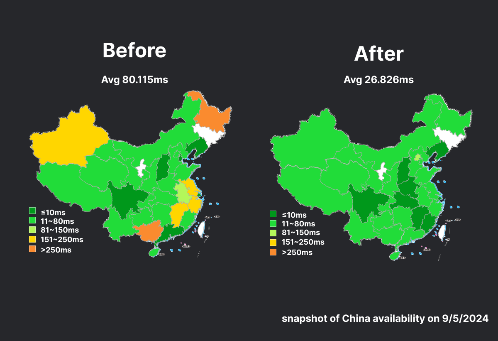

We're excited to announce some improvements to cloud infrastructure which
improve patch delivery, availability, and performance around the world 🥳

## What's Changed

When a patch is published via `shorebird patch`, the generated patch artifact is
uploaded to Shorebird's cloud. On app launch, the corresponding release running
on users' devices will ping Shorebird's API to check whether a newer patch is
available. If a newer patch is available, Shorebird's API will respond with a
link to the patch artifact and the patch is then downloaded and installed on the
device.

We've made some improvements to how we store and serve patch artifacts to both
improve availability and performance — patches can be downloaded faster in more
places around the world.

## Wider Availability

We've made some changes to our cloud infrastructure to enable Shorebird to
deliver patches to more regions around the world. You may now find that users
are able to download patches in regions that were previously unavailable.

## Faster Downloads

Our cloud infrastructure improvements have also reduced the time it takes to
download patches around the world. The following snapshot of data illustrates
the average time it took to download a 1mb patch before and after the
improvements.

**Average Response Times**

| Location       | Before | After |
| -------------- | :----: | :---: |
| Netherlands    | 543ms  | 59ms  |
| USA            | 556ms  | 137ms |
| Germany        | 754ms  | 211ms |
| India          | 1730ms | 156ms |
| United Kingdom | 748ms  | 78ms  |
| Australia      | 1113ms | 153ms |
| Nigeria        | 1891ms | 826ms |
| Korea          | 1949ms | 45ms  |

_Note: snapshot of data taken on 9/5/2024_

## Get Started

These infrastructure improvements are already rolled out to all Shorebird
customers around the world. 🥳

If you're new to Shorebird and want to get started, head over to the
[Shorebird Console](https://console.shorebird.dev).
