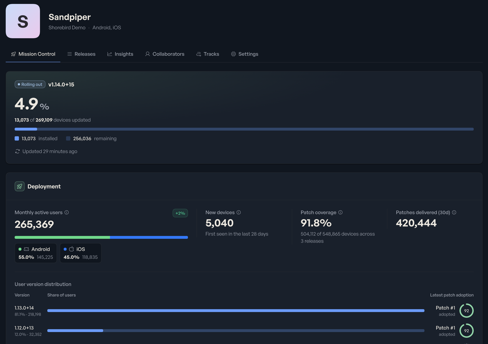
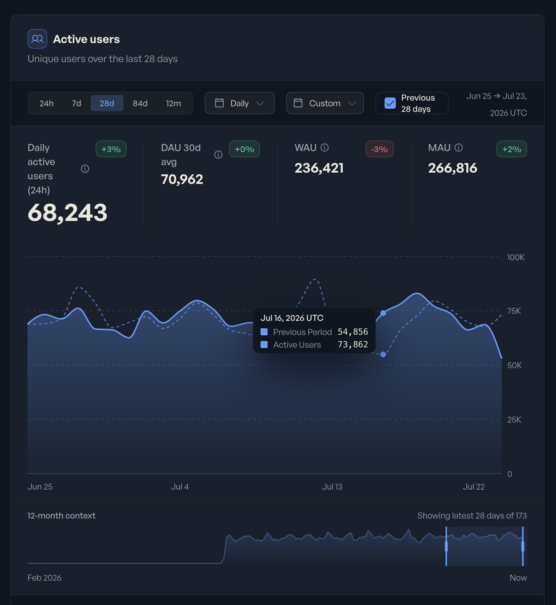
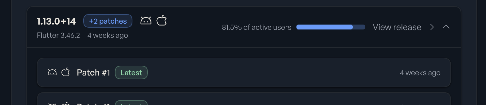
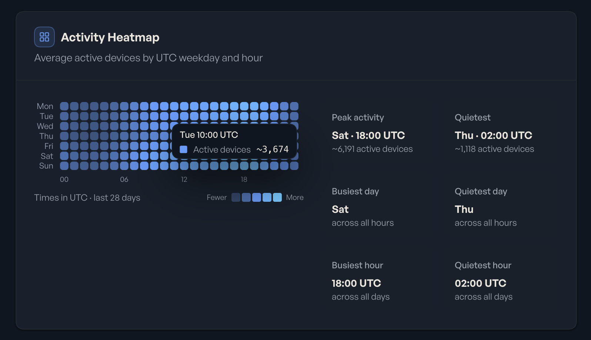

<!-- Converted from the Webflow CMS export by scripts/import_webflow.py -->

You may have noticed recent improvements to our Insights surfaces. We've been
striving to offer richer and more robust analytics on the current and historical
state of your app. Essentially we're offering a bird's eye view to help you ship
and patch with confidence.

Historically the console has been structured around the operation of what you
want to do in the Shorebird console: manage a release, ship a patch, or run
administrative tasks for your organization. This provided a fragmented, not a
holistic experience. Mission Control puts your application at the center no
matter what task you're trying to achieve. Want to know what patches are in
flight? How about if it's safe to sunset a release? Details on the version
adoption, app size, or build performance? All those answers can be found in
Mission Control.

Maybe you've been stitching this data together across various data sources or
putting this work off for another day.

The new Mission Control tab provides data on the health of your app and the
status of patch rollouts. Historical views into how your releases have trended
over time can still be found in the Insights tab.

## At-a-glance situational awareness

Mission Control is the new default view when you open an app, helping you
definitively know whether the changes you're pushing out are getting applied.
Previously you had to look at patch installs, correlate that with MAU data from
other sources, and infer that everything was running smoothly. The Live Rollout
card surfaces this information immediately, giving you that extra confidence
without correlating data from multiple sources.

And for those occasions when something doesn't go quite right with a patch,
there's a big 'ol rollback button in the Live Rollout card for patches, reducing
the number of clicks needed to revert a bad patch. Coming soon you'll also see
patch install failures on this card, making it even more actionable.

## Confidence in your patches

When you're urgently trying to fix a critical issue and want to instantly know
it's been resolved as quickly as possible, patch coverage meters show you just
that. You don't have to watch patch installs to know the fix is in place.

## Understanding your fleet

Mission Control provides aggregate data in addition to per-platform data. You
don't need to install a separate analytics tool, or roll your own, to get
comprehensive measurements across both platforms. View MAUs and DAUs in
aggregate or per platform to better understand traffic shifts and user adoption.

Combine that with per-version release distribution and you'll know it's safe to
sunset an old release.

While we roll out Mission Control, all of its analytics are available for free
to everyone. We'll introduce pricing later.

If you haven't logged into the console for a while, take a look and let us know
what other insights you want to see in Mission Control.
