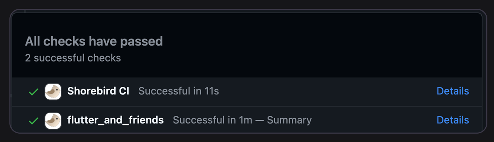
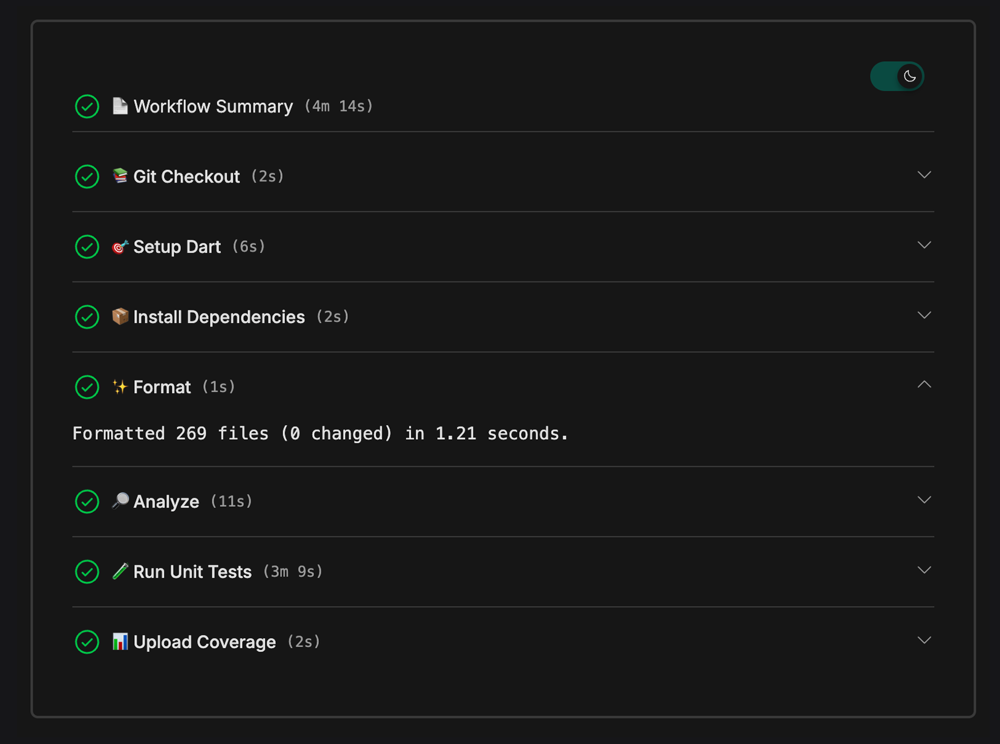

We’re thrilled to announce our newest product:
[Shorebird CI](https://ci.shorebird.dev) — a zero-config continuous integration
system built exclusively for Flutter and Dart by the very people who created
Flutter. We opened this up for a small preview in
[early August](https://x.com/shorebirddev/status/1950593850965459226) and are
ready to officially launch it in Beta today.

You’ve got a product to deliver. Who wants to wrestle with YAML? Or spend hours
fiddling with CI pipelines that weren’t built with Dart and Flutter in mind? Why
isn’t there a CI solution that just works out of the box and enforces best
practices?

While building Code Push, we kept running into those same questions and realized
there wasn’t anything available that met our needs. So we built it.

<iframe width="560" height="315" src="https://www.youtube.com/embed/ZMMV418Dt80?si=Ec4cphd4vm1WFBEI" style="display:block;margin: 0 auto;" title="YouTube video player" frameborder="0" allow="accelerometer; autoplay; clipboard-write; encrypted-media; gyroscope; picture-in-picture; web-share" referrerpolicy="strict-origin-when-cross-origin" allowfullscreen></iframe>

## Why We Built Shorebird CI

From countless conversations with customers, we kept hearing the same story.
Code Push made deploying instant updates effortless, but their CI pipelines were
still slow, clunky, and expensive. Some teams even had entire roles dedicated to
maintaining CI.

That’s not how it should be. CI should be fast, invisible, and effortless. You
should be spending your time building features and customer value, not
pipelines.

## Our Focus

In building Shorebird CI we focused on 4 key points.

- **Blazingly Fast** — In our tests, Shorebird CI delivered up to 5× faster
  pipelines compared to typical setups. Thanks to quick startup times and
  reliable change detection, we run only the affected packages and automatically
  parallelize builds for maximum speed.
- **Zero-Config Setup** - Forget giant YAML files and bash scripts. By
  statically analyzing your project, Shorebird CI can infer most of your config
  automatically.
- **Dart-Native** - Works with any Dart or Flutter project. It's always up to date
  with the latest Dart and Flutter changes so you’re never blocked from adopting
  new features.
- **Mono-repo Aware** - Growing into a mono-repo? We handle it out of the box,
  so you can start small and scale without painful migrations.

From indie apps to Fortune 500 enterprises moving to Flutter, these principles
make CI faster, simpler, and more reliable for everyone.

## Pricing

Much like our pricing for Code Push, we want to be able to serve the community
and open source needs while allowing for larger customers with more extensive
needs. While we are in this Beta period we have 2 tiers.

- Hobby - Free during this beta period for public repositories. This includes
  all Shorebird CI features so you can run fast, zero-config pipelines for your
  community projects.
- Pro — A simple $20 per month. This includes up to 100 hours of compute per
  month in a secure, private tenant to keep your code safe. This plan is
  required for use with private repositories.

Pricing may change after this beta period as we learn more about customer usage
and move toward general availability. Our goal will always be simple,
transparent, and scale with your need pricing.

## Getting Started

Zero-config really means zero-config. With just a few quick steps, you’ll have
your account linked and be up and running.

1. Log into the [Shorebird Web Console](https://console.shorebird.dev) and
   select CI from the navigation panel.
2. Sign in with your GitHub account to grant access to your repositories.
3. In the Web Console, enable access for your GitHub organization and choose the
   repositories you want to connect.
4. Open a pull request.

Yep, that's really it.

From there, Shorebird CI automatically runs checks for analysis warnings,
misspelled words, ensuring your tests are passing and more.

If you want to learn more about the checks we currently have built in, check out
our [documentation](https://docs.shorebird.dev/ci/checks). Already have other
checks you depend on? Let us know — we’re adding more soon and prioritizing the
ones our customers rely on most.

## What's Next

We’re just getting started with Shorebird CI. This Beta is our chance to learn
alongside you and find out what works well, what’s missing, and how we can make
CI even faster and simpler for Flutter teams of all sizes.

Over the coming months we hope to have support for more checks, smarter scaling
for even more performance, and a refined pricing model based on real world
usage. We want the feedback loop to be tight and make sure that your input helps
shape where we go next.

This Beta is the beginning of a long journey. We’re excited to build it with
you. [Get started today](https://ci.shorebird.dev) and let us know what you
think.
