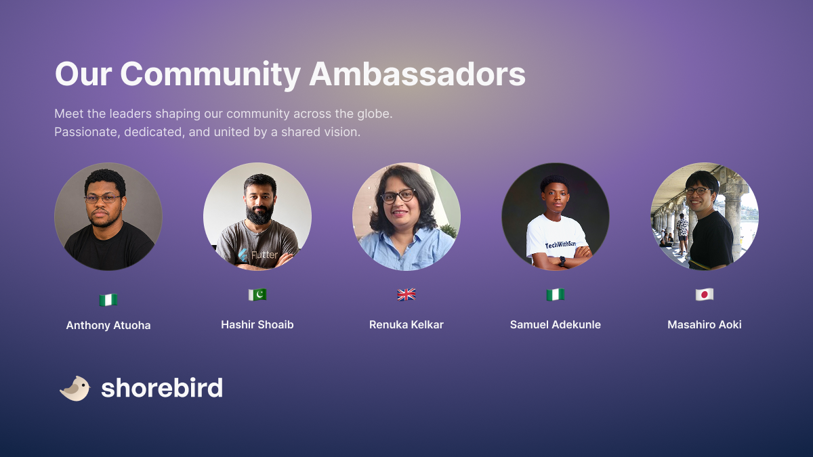

<!-- Converted from the Webflow CMS export by scripts/import_webflow.py -->

Back in June, we opened applications for the
[Shorebird Community Ambassador program](https://shorebird.dev/blog/shorebirds-community-ambassador-program),
to recognize the Flutter developers who were creating content, mentoring others,
and advocating for Shorebird in their communities. After reviewing applications
from around the world, we're excited to introduce our first group of Community
Ambassadors.

_Introducing the first Community Ambassador cohort_

## Our first Community Ambassadors

### [Hashir Shoaib](https://www.linkedin.com/in/hashirshoaeb/) (Pakistan)

Hashir Shoaib is a Flutter engineer, educator, and builder behind
[Hacking with Flutter](https://www.hackingwithflutter.com/). With 5+ years of
experience building Flutter applications, he's passionate about helping
developers grow through structured learning, technical content, and community.

### [Renuka Kelkar](https://www.linkedin.com/in/renukakelkar/) (London, United Kingdom)

Renuka Kelkar is an AI Instructor at Multiverse, AI Developer Advocate, Google
Developer Expert in Flutter and Dart, community leader, and technology educator
with more than 15 years of experience.

She specializes in Flutter, Firebase, generative AI, AI agents, Google ADK, and
practical AI-powered applications. Through workshops, conferences, codelabs, and
community programs, she has trained and supported more than 5,000 developers
worldwide.

As an organizer of GDG London, Renuka leads developer events, workshops, and
initiatives such as AI DevCamp to help the community learn emerging
technologies. She is also a Women Techmakers Ambassador and the founder of
TechPowerGirls, empowering more girls and women to build careers in technology.

### [Anthony Atuoha](https://www.linkedin.com/in/atuoha-anthony/) (Lagos, Nigeria)

Anthony is a Senior Mobile Software Engineer and community builder who enjoys
creating software, sharing knowledge, and helping other developers grow. His
work spans building production-grade applications and contributing to the wider
developer community through writing, speaking, and mentoring.

### [Samuel Adekunle](https://www.linkedin.com/in/techwithsam/) (Nigeria)

Samuel is a software engineer and tech educator based in Nigeria. Through his
Tech With Sam platform, he creates practical tutorials that help thousands of
developers master Flutter and mobile development worldwide. He is the creator of
MyVista, a simple personal finance tracker tool, and has contributed
significantly to ChopGrub and 1app as a senior mobile engineer.

### [Masahiro Aoki](https://www.linkedin.com/in/masahiro-aoki-b68905163/) (Tokyo, Japan)

Masahiro has been building with Flutter for a long time, including two to three
years of hands-on Shorebird experience as an early adopter. He shows up across
formats, technical writing, video content, workshops, and speaking at events and
meetups, and has published Shorebird content on his
[YouTube channel](https://www.youtube.com/watch?v=pRoKzWbMcNA).

Each of them was selected for a solid understanding of Flutter and Shorebird, a
track record of actively helping other developers through content, mentoring, or
community support, and a genuine motivation to grow the Shorebird community in
their region.

## What to expect from them

Over the coming months, you'll see our Community Ambassadors showing up across
the places you already find Shorebird content: writing blog posts and tutorials,
speaking at local meetups and conferences, answering questions in Discord, and
sharing what they're building with Shorebird.

## Want to become a Community Ambassador?

This is just the first group, and we'll continue reviewing applications on a
rolling basis. If you're a Flutter developer who's already creating content,
speaking at events, or helping others in the community,
[fill out the application form](https://docs.google.com/forms/d/e/1FAIpQLSfHeULk8JMGIdRX9Xfs2W_5SXH3sMP43HW7PSKMNhs89tDnuA/viewform)
to be considered.
