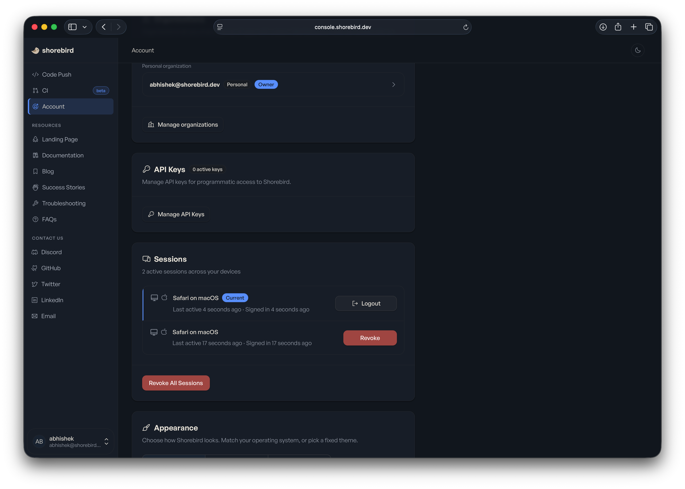
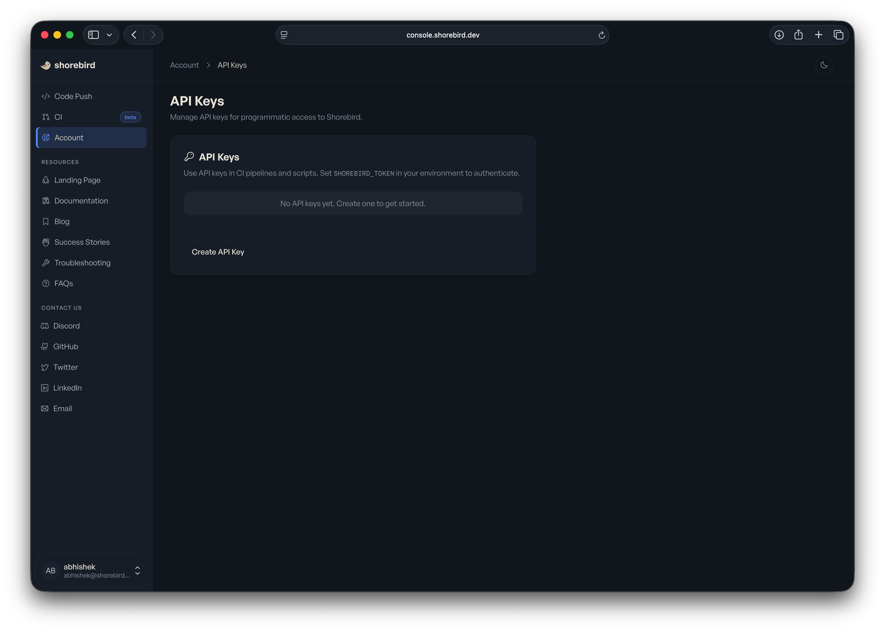
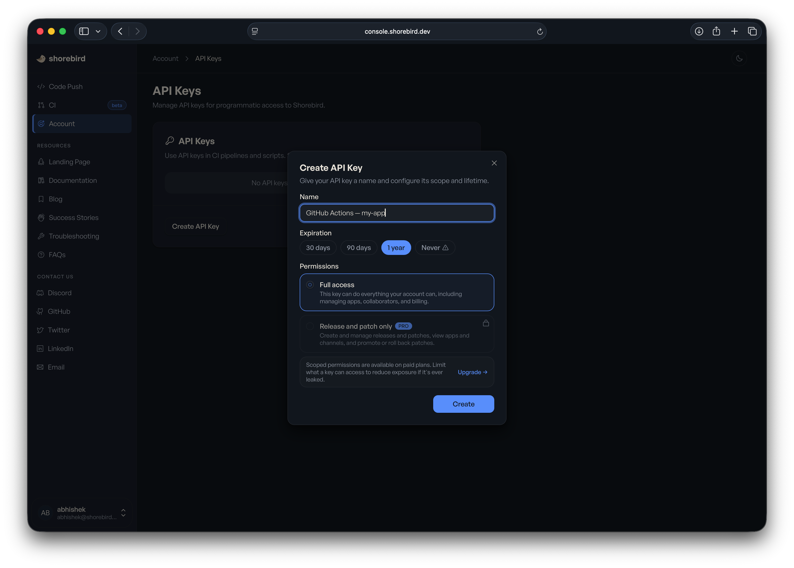
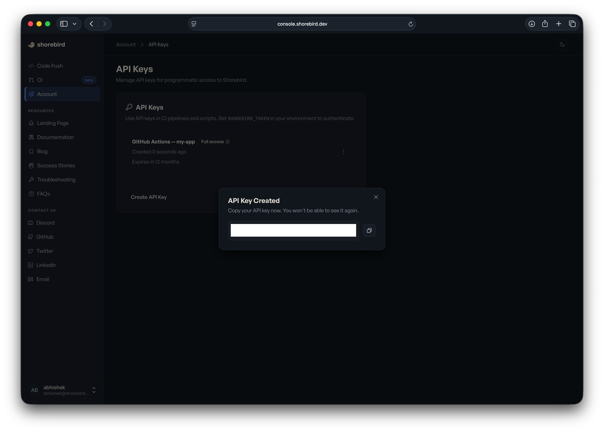

<!-- Converted from the Webflow CMS export by scripts/import_webflow.py -->

If your CI pipeline still uses a `SHOREBIRD_TOKEN` generated by
`shorebird login:ci`, it's time to upgrade.

Earlier this year we rolled out a
[new auth service](https://shorebird.dev/blog/introducing-shorebirds-upgraded-auth-service)
that issues Shorebird's own tokens instead of proxying Google or Microsoft
refresh tokens. The new tokens — Shorebird API keys — are better in every
dimension that matters: you pick the expiration, you scope the permissions, you
can revoke them instantly, and they're flagged automatically when leaked.
Existing `login:ci` tokens keep working through **September 2026**, after which
they stop. The Shorebird CLI already prints a deprecation warning on every
command when it sees a legacy token, so you'll know which pipelines still need
migrating.

This post is the practical follow-up to
[the auth service announcement](https://shorebird.dev/blog/introducing-shorebirds-upgraded-auth-service):
why you should upgrade, and exactly how — generating a new API key, swapping it
into your CI secrets, and confirming the new token works.

## Why upgrade

Until this year, your `SHOREBIRD_TOKEN` was effectively a Google or Microsoft
OAuth refresh token in a Shorebird envelope. Functional, but it tied your CI
access to whatever the upstream identity provider allowed. We couldn't set
Shorebird-specific timeouts. We couldn't revoke individual access. And a CI
token had the same permissions as a human session, the keys to the kingdom,
sitting in a secret manager.

API keys fix all of that.

- **You pick the expiration.** 30 days, 90 days, 1 year, or never.
- **You scope the permissions.** "Release & Patch only" exists for CI pipelines
  that should ship code but should never delete a release, change org
  membership, or touch billing. (Pro and Business plans)
- **You revoke instantly.** Delete the key from the console and the next CI run
  fails.
- **Leaks get flagged.** API keys carry the `sb_api_` prefix, registered with
  GitHub's secret-scanning service which means a leaked key in a public repo
  gets reported automatically.
- **Storage is one-way.** Shorebird stores only an irreversible hash of the key.
  Nobody at Shorebird, including us, can read your key back to you.

For the architecture behind this (short-lived JWTs, refresh tokens, session
management, audit logs, SAML), see the
[original announcement](https://shorebird.dev/blog/introducing-shorebirds-upgraded-auth-service).

## How to upgrade

The migration is easy: generate a new key in the console, swap it into your CI's
secrets, run the workflow once to confirm. Your CI workflow files don't change
and the environment variable name (`SHOREBIRD_TOKEN`) is the same.

<iframe src="https://demo.arcade.software/TQUMnX2QwuCRzEV1e8kN?embed&amp;embed_mobile=tab&amp;embed_desktop=inline&amp;show_copy_link=true" title="Create and Manage an API Key for Programmatic Access" frameborder="0" loading="lazy" webkitallowfullscreen="" mozallowfullscreen="" allowfullscreen allow="clipboard-write" style="position: absolute; top: 0; left: 0; width: 100%; height: 100%; color-scheme: light;"></iframe>

### 1. Generate a new key

Sign in at [console.shorebird.dev](http://console.shorebird.dev/) and open
**Account → API Keys**.

Click **Manage API Keys**.

Give it a descriptive name, something like `GitHub Actions — my-app`. The name
only matters to you and your team when you're auditing keys later.

Pick an expiration. We default to 1 year. For CI we recommend the shortest
expiration you're willing to rotate.

Pick a permission tier if your plan supports it. **Release & Patch only** is the
right choice for almost every CI pipeline: it can ship releases and patches, and
it can't do anything else.

Click **Create**.

### 2. Copy the key

The full key value is shown exactly once. Copy it now as there is no way to
retrieve it later. If you lose it, generate a new one.

The key starts with `sb_api_`.

### 3. Install it in your CI

In your CI provider's secrets manager, find the existing `SHOREBIRD_TOKEN` and
replace its value with the new key. The environment variable name is unchanged,
so nothing else needs to move.

- **GitHub Actions:** Settings → Secrets and variables → Actions →
  `SHOREBIRD_TOKEN` → Update secret.
- **Codemagic, Bitrise, CircleCI, etc.:** Same idea, different menu names. Find
  where `SHOREBIRD_TOKEN` is stored and replace the value.

For provider-specific setup, see our
[CI integration docs](https://docs.shorebird.dev/ci/).

### 4. Run the workflow once

Trigger a build and confirm the Shorebird step succeeds. If you've been seeing
the legacy-token deprecation warning in CI logs, it should be gone after this
run.

### 5. Delete the old key

Once the new key is working, delete the old `login:ci` token from the console or
let it expire on its own. There's nothing to clean up locally.

## Rotation, not migration

The migration above is also the rotation flow. Generate a new key, swap it into
your secrets manager, delete the old one. That's it. With expiration set to 90
days or 1 year, rotation becomes a normal, boring part of your CI hygiene
instead of a thing nobody touches because the token "just works."

## Deprecation timeline

Tokens issued by `shorebird login:ci` will keep working through **September
2026**. After that, they stop. The CLI warns on every command when it sees a
legacy token, so you'll know which pipelines still need attention.

If you have a lot of pipelines, do them one at a time. You don't have to migrate
everything at once.

## Further reading

- [Introducing Shorebird's upgraded auth service](https://shorebird.dev/blog/introducing-shorebirds-upgraded-auth-service)
  — the architecture and the roadmap.
- [API Keys docs](https://docs.shorebird.dev/account/api-keys/) — the source of
  truth for the console flow, including key revocation and expiration options.
- [CI integration guides](https://docs.shorebird.dev/ci/) — per-provider setup
  for GitHub, Codemagic, Fastlane, and generic CI.
