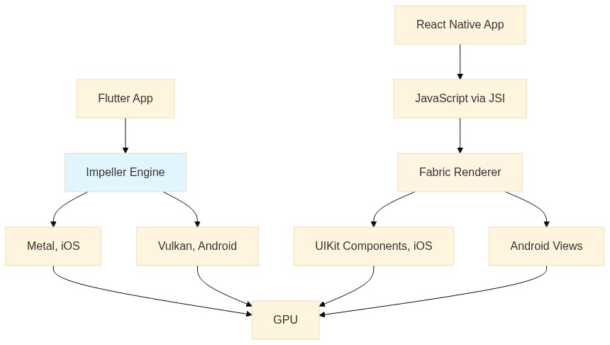
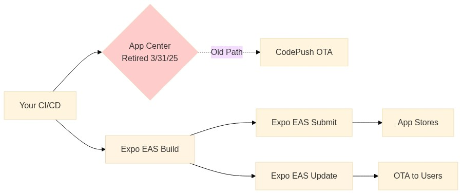
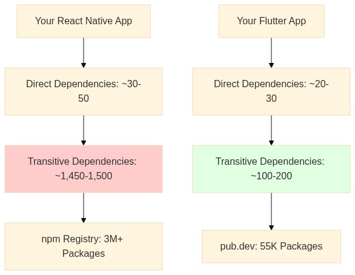

<!-- Converted from the Webflow CMS export by scripts/import_webflow.py -->

If you’re a CTO in 2026, choosing between React Native and Flutter is no longer
a developer preference debate. It has turned into a long-term platform decision.

Both frameworks are mature. Both power large-scale consumer apps. Both promise
shared code across iOS and Android. But under the surface, they make very
different trade-offs around rendering architecture, ecosystem stability, hiring
pipelines, upgrade friction, and operational control.

The real questions aren’t about “which is faster.” They’re about risk and
leverage. How much control do we retain over our delivery pipeline? How often
will OS changes force emergency patches? What does maintenance look like in year
four? Can we ship critical fixes instantly during peak traffic? How does this
choice affect compliance, security reviews, and total cost over five years?

This guide breaks down those differences from an enterprise perspective so you
can make a decision that holds up long after the prototype phase.

## The Rendering Architecture Split

Enterprise apps serve millions of users across dozens of device models. When
your banking app renders a transfer button with the wrong theme on Android but
with the right one on iOS, users notice. When your retail checkout stutters
during holiday traffic, revenue drops. Performance is incredibly important.

Flutter owns the entire rendering stack. The
[Impeller engine](https://docs.flutter.dev/perf/impeller) (which replaced
[Skia](https://skia.org/) in 2024) compiles shaders ahead-of-time at build. No
runtime compilation means no noticeable jank in animation. Impeller uses Metal
on iOS and Vulkan on Android, talking directly to the GPU without OS-mediated
layers.

Production data backs this up. Flutter’s 2026
[benchmarks show 30-50% fewer jank frames during complex animations compared to the old Skia renderer](https://devnewsletter.com/p/state-of-flutter-2026/#:~:text=The%20impact%20proved,causes%20visible%20stutters.).
The [SynergyBoat
benchmark](https://www.synergyboat.com/blog/flutter-vs-react-native-vs-native-performance-benchmark-2025?utm_campaign=state-of-flutter-2026&utm_medium=referral&utm_source=devnewsletter.com#:~:text=Flutter%3A%20(Dropped%200%25%2C%20Jank%200%25%29%C2%A0)
measured worst-case frame drops: 0% dropped frames with Flutter (using Impeller)
versus 15.51% with React Native and 1.61% with Swift (native). For real-time
trading apps or video streaming interfaces, that difference is user-visible.

React Native took a different path with the
[New Architecture](https://reactnative.dev/docs/the-new-architecture/landing-page).
JSI (JavaScript Interface) replaced the old asynchronous bridge, enabling direct
C++ communication. Fabric handles rendering with synchronous layout
calculations. The performance gap closed significantly, but React Native still
maps your components to native iOS and Android UI elements. You write `<Text>`,
it renders a `UILabel` on iOS or `TextView` on Android.

Here's how the rendering process of the two compare against one another at a
quick glance:

This creates the core trade-off. React Native components look and feel native
because they use native controls. Your app automatically inherits iOS’s San
Francisco font and Material Design typography on Android. Flutter draws
everything itself, so you explicitly choose how text renders across platforms.

But that native component dependency means OS updates can break your UI
silently. When
[iOS 17 changed how `TextInput` handled emoji](https://appleinsider.com/articles/23/07/18/hands-on-with-all-the-new-messages-features-in-ios-17#:~:text=This%20update%20adds%20the%20ability,sticker%20from%20a%20home%20video),
React Native apps inherited that behavior. Flutter apps rendered identically.
When Samsung ships a One UI update that modifies `TextView` padding, your React
Native app on Galaxy devices changes behavior. Flutter stays consistent.

The practical impact shows up in QA. Samsung phones in India, Xiaomi devices in
China, Google Pixels in the US all run different Android builds with vendor
modifications. Flutter’s pixel-level control means you test once. React Native’s
native component reliance means testing device matrices, because
Samsung-specific quirks only appear on Galaxy phones. It all comes down to “are
you in control of the user experience you’re offering, or is the platform?”

## The Deployment Crisis

Enterprise operations teams need to be in control. When a payment bug surfaces
on Black Friday, or a healthcare app crashes for patients with specific
conditions, you can’t wait 48 hours for Apple’s review team. This requirement is
non-negotiable.

React Native teams have had an advantage over other platforms in over-the-air
updates for years. Microsoft’s App Center CodePush was reliable infrastructure.
You pushed JavaScript updates, users got them instantly, and it integrated
cleanly with existing CI/CD pipelines. Enterprises built critical workflows
around it.

**React Native deployment options**

Then Microsoft shut it down. The
[retirement announcement](https://learn.microsoft.com/en-us/appcenter/retirement)
gave teams one year to migrate. That sounds generous until you’re managing
production apps with millions of users and complex deployment pipelines.

The migration options were limited: self-host the open-source CodePush server
(which Microsoft deliberately kept as a private “special version”), use Expo
EAS, or build your own. Most chose Expo EAS. It works, but it’s not a drop-in
replacement.

While
[EAS Update works without requiring other EAS services](https://docs.expo.dev/eas-update/standalone-service),
it is still designed with the entire ecosystem in mind. If you want to make full
use of EAS’s bookkeeping and insights features, you would need to refactor
existing CI/CD built on GitHub Actions, Jenkins, or internal tools. In such a
case, you’re not just buying OTA updates, you’re adopting Expo’s managed
workflow. For enterprises with established build infrastructure and security
requirements about where code compiles, this creates friction.

The pricing model compounds at scale. Expo charges per Monthly Active User
(anyone who downloads at least one update) plus bandwidth. Every update
downloads the full JavaScript bundle. A 12MB bundle to 500,000 users consumes
~6TB of bandwidth. Ship monthly hotfixes, that’s 72TB annually.

As of February 2026, Expo’s enterprise tier starts around $1,000-2,000 monthly
with usage-based charges on top. A realistic enterprise scenario: fintech app,
500,000 active users, monthly security patches. Base cost plus overages runs
$25,000-30,000 annually just for OTA capability.

[Shorebird](https://shorebird.dev/) works differently. You keep your existing
build system. Shorebird provides a modified Flutter engine that enables
[code push](https://docs.shorebird.dev/code-push/), but you still run your
builds wherever you want. Run `shorebird release` instead of `flutter build`,
push artifacts to stores normally, then `shorebird patch` for instant updates.

The pricing is transparent: usage-based on
[patch installs](https://shorebird.dev/pricing/). Free tier covers 5,000
installs monthly, then $0.01 per install. Same scenario (500,000 users, monthly
patches): in the Business tier, cost would come out to be $400 per month, or
$4800 annually. For volumes larger than 1M patch installs per month, you can
[contact the sales team](https://calendly.com/d/cmtb-j7m-qpb/shorebird-sales)
for pricing.

For targeted rollouts (shipping fixes only to premium users or specific
regions), the economics diverge further. Expo charges for all MAUs whether they
get updates or not. Shorebird charges only for actual installations.

## Security and Supply Chain Trust

Enterprise security teams evaluate frameworks through attack surface,
auditability, and supply chain trust. Both frameworks pass basic requirements
(certificate pinning, OAuth integration, secure storage), but architectural
differences create distinct risk profiles.

A standard JavaScript/React project pulls anywhere between 700 to 1,500 packages
from npm on install. Each package can execute code during installation via
preinstall scripts. Each has its own dependencies. Any of those packages could
be compromised.

**Flutter vs React Native dependencies and package repositories at a glance**

Flutter’s [pub.dev](https://pub.dev/) ecosystem is smaller (55,000 packages
versus npm’s 3+ million), more curated, and critically, pub doesn’t execute code
during package installation. The attack surface for supply chain compromises is
structurally smaller. For enterprises implementing
[SLSA framework](https://slsa.dev/) compliance, a smaller, controlled dependency
tree is easier to audit and monitor.

Code obfuscation provides another layer. Flutter compiles Dart to native ARM
machine code using AOT compilation. The resulting binary is difficult to
reverse-engineer, comparable to native Swift or Kotlin apps. React Native ships
JavaScript bundles. Even minified and obfuscated, they remain more accessible.
Tools like [jadx](https://github.com/skylot/jadx) can decompile React Native
bundles in minutes. Flutter’s compiled binaries require significantly more
effort.

Shorebird’s OTA architecture was designed around security constraints.
[Patch signing](https://docs.shorebird.dev/code-push/guides/patch-signing/) uses
Ed25519 cryptographic signatures. Patches are signed with your private key,
which never leaves your infrastructure. The Shorebird CDN delivers patches but
can’t modify them. For enterprises in regulated industries (fintech, healthcare,
government), this separation of delivery from signing authority is essential.

Expo EAS provides similar signing, but because EAS controls your build
environment, you’re trusting Expo’s infrastructure for key security. Many
enterprises prefer Shorebird’s model where keys stay in your control, integrated
with existing secrets management (HashiCorp Vault, AWS KMS, Azure Key Vault).

## Brownfield Integration Patterns

Enterprise mobile strategy rarely starts from zero. Most large organizations
already ship native iOS and Android apps generating revenue and serving millions
of users. The question becomes: how do we modernize without rewriting
everything?

React Native was designed for this. Facebook built it to add features to their
massive native app without total rewrites. The integration story is mature.
Create a React Native view controller on iOS or fragment on Android, initialize
the JavaScript runtime, render React Native screens alongside native UI.
Companies like Shopify and Microsoft used this approach for years, gradually
increasing React Native adoption screen by screen.

Flutter’s “Add-to-App” module matured significantly in Flutter 3.x. You embed
Flutter screens in existing native apps with comparable integration effort to
React Native. The Flutter engine initializes, renders to a native view,
communicates with native code through
[platform channels](https://docs.flutter.dev/platform-integration/platform-channels).
[eBay Motors adopted Flutter](https://innovation.ebayinc.com/stories/ebay-motors-accelerating-with-fluttertm/)
for adding specific features in existing native apps.

The practical difference is ecosystem tooling. React Native benefits from nearly
a decade of community tools for brownfield integration. Documentation covers
edge cases, popular libraries handle common patterns, StackOverflow has answers.
Flutter’s brownfield story works but has less community polish.

For greenfield deployments (new apps or complete rewrites), Flutter is clearer.
You’re not managing bridge complexity between JavaScript and native code. You
write Dart, compile to native, avoid the architectural complexity React Native’s
JSI introduces. Virgin Money consolidated separate iOS and Android codebases
into unified Flutter, reporting faster feature delivery and reduced QA
complexity.

The hiring consideration factors in. JavaScript developers outnumber Dart
specialists roughly 5:1 in most markets. Need to scale from 5 to 25 engineers in
six months? You’ll fill React Native roles faster. But quality distribution
differs.

Flutter developers tend to be mobile specialists who understand platform
constraints: memory management, lifecycle handling, push notifications. React
Native’s web-to-mobile pipeline often surfaces developers strong in React but
weaker in mobile fundamentals.

This manifests as different productivity curves. React Native teams onboard
faster (web devs ship mobile code in weeks) but hit mobile-specific challenges
where the web mental model breaks. Flutter teams take longer to onboard
(learning Dart and Flutter’s widget model) but once productive, ship more
reliably because the framework forces mobile-first thinking.

## The Decision Matrix

| Factor           | Flutter + Shorebird                                                                             | React Native + Expo EAS                                                                                       |
| ---------------- | ----------------------------------------------------------------------------------------------- | ------------------------------------------------------------------------------------------------------------- |
| **Rendering**    | Impeller (Metal/Vulkan). Direct GPU access. Pixel-perfect consistency. Immune to OS UI changes. | Native components via Fabric. Authentically native look. Subject to OEM behavior changes.                     |
| **OTA Updates**  | Shorebird. Patch signing. Any CI/CD. Installs-based pricing.                                    | Expo EAS. Full bundle downloads. Requires Expo builds. MAU + bandwidth based pricing.                         |
| **Performance**  | Native AOT to ARM. Consistent 60/120fps. Predictable worst-case frame times.                    | JSI removes bridge overhead. Hermes precompiles. Good for most UIs, complex animations may need optimization. |
| **Security**     | Strong typing. Binary obfuscation by default. Small dependency graph (55K packages).            | Minified JavaScript is reversible. Large npm attack surface (3M+ packages). Needs additional hardening.       |
| **Supply Chain** | Curated pub.dev. Google-maintained core. No install-time code execution.                        | npm ecosystem. ~1000 packages standard. Preinstall scripts can execute code.                                  |
| **Hiring**       | Smaller pool. Mobile-specialist focus. Dart requires learning.                                  | Massive JavaScript pool. Lower barrier from web. Variable mobile expertise.                                   |
| **Brownfield**   | Add-to-App stable. Less mature tooling.                                                         | Excellent. Designed for incremental adoption. Mature community tools.                                         |
| **Platforms**    | Mobile, web, desktop, embedded. Single codebase.                                                | Mobile-focused. Web/desktop exist but less mature.                                                            |

## Total Cost Over 5 Years

Enterprise mobile investment spans 5-10 years. The framework decision compounds
over that timeline. React Native appears cheaper Day 1: faster hiring, larger
talent pool, lower learning curve. But structural costs emerge in Years 2-5.

JavaScript ecosystem volatility creates maintenance burden. Major packages break
compatibility. React Native ships breaking changes regularly. The New
Architecture migration required significant refactoring for most teams. The 2024
State of React Native survey found 62% of teams spent significant effort
upgrading dependencies, and 31% described dependency management as their biggest
pain point.

Flutter’s
[structured releases](https://docs.flutter.dev/release/breaking-changes) and
Google-maintained core packages provide more stability. The framework has
breaking changes, but they’re fewer and better documented. Enterprise teams
report reduced maintenance burden compared to React Native codebases at 2-3
years.

Platform updates hit differently. When iOS or Android ships a new version,
Flutter apps generally work without changes. The rendering engine is independent
of OS UI components. React Native apps often require updates to handle new OS
behavior because they use native components the OS update modified.

The deployment cost equation changed with App Center’s retirement. React Native
teams now pay Expo’s MAU pricing or build their own OTA infrastructure.
Shorebird’s transparent usage pricing makes Flutter’s deployment costs
predictable and often lower at enterprise scale.

Here’s a real scenario to consider:

| Framework        | Year 1               | Years 2–3                                      | Years 4–5               |
| ---------------- | -------------------- | ---------------------------------------------- | ----------------------- |
| **React Native** | Lower initial cost   | Dependency upgrades & platform update fixes    | Accumulated tech debt   |
| **Flutter**      | Higher learning cost | Stable dependencies & OS-independent rendering | Predictable maintenance |

Fintech app, 500,000 active users, 5-year timeline. React Native Year 1 costs
less (faster development, easier hiring). But Years 2-5 include Expo EAS OTA
costs ($25,000-30,000 annually), dependency upgrade sprints (2-3 weeks
annually), platform update fixes (1-2 weeks per major OS release). Accumulated
TCO over 5 years runs roughly $150,000-200,000 beyond base development.

Flutter Year 1 costs more (Dart learning, slightly longer development). But
Years 2-5 include Shorebird OTA costs (~$16,000-30,000 annually with better
control), fewer upgrade sprints, minimal platform update work. Accumulated TCO
over 5 years runs roughly $130,000-170,000 beyond base development.

The TCO model favors Flutter for long-lived, maintained codebases. Higher
upfront cost pays back through lower maintenance burden, predictable upgrade
paths, simpler platform update handling.

## Making the Call

Choose React Native if you’re web-first with strong React expertise, building
features that need authentic iOS/Android native feel, on a short timeline where
hiring speed matters more than long-term maintenance. The JavaScript ecosystem
and lower learning curve make it pragmatic for shops already invested in web
stacks.

Choose Flutter if you’re building an asset meant to last 5-10 years, where UI
consistency across platforms matters more than per-platform authenticity, where
security audits demand supply chain control, where deployment agility can’t
sacrifice security for convenience. With Shorebird, you’re not choosing between
performance and agility. You get both.

The App Center retirement was a forcing function. It exposed React Native’s
dependence on external services for critical enterprise features. Flutter’s
answer, through Shorebird, is
[integrated deployment built into the framework](https://docs.shorebird.dev/code-push/system-architecture/)
without forcing managed build services or unpredictable pricing.

For CTOs evaluating mobile strategy in 2026, the math changed. Flutter closed
its deployment gap. The performance and consistency advantages remain. The
security posture is structurally stronger. The TCO favors Flutter for long-lived
projects.

## Next Steps

Now that you understand the enterprise framework landscape, here are concrete
next steps based on your situation:

**If you’re choosing Flutter and Shorebird:**

- [Get started with Shorebird](https://docs.shorebird.dev/getting-started/) to
  add code push to your Flutter app in under 5 minutes
- Review the
  [development workflow guide](https://docs.shorebird.dev/code-push/guides/development-workflow/)
  to integrate Shorebird into your existing CI/CD pipeline
- Explore
  [percentage-based rollouts](https://docs.shorebird.dev/code-push/guides/percentage-based-rollouts/)
  for gradual deployment strategies that minimize risk
- Implement
  [patch signing](https://docs.shorebird.dev/code-push/guides/patch-signing/) to
  meet enterprise security requirements
- Set up
  [GitHub Actions integration](https://docs.shorebird.dev/code-push/ci/github/)
  or [generic CI/CD workflows](https://docs.shorebird.dev/code-push/ci/generic/)
  for automated patching

**If you’re evaluating security and compliance:**

- Review Shorebird’s
  [security documentation](https://docs.shorebird.dev/system/security/) to
  understand the cryptographic architecture
- Learn how [patch rollback](https://docs.shorebird.dev/code-push/rollback/)
  provides instant recovery from bad deployments
- Understand the
  [system architecture](https://docs.shorebird.dev/code-push/system-architecture/)
  to evaluate how it fits your infrastructure

**If you’re migrating from React Native:**

- Read about companies that have made similar transitions in the
  [success stories](https://shorebird.dev/success-stories/)
- Check current
  [Flutter version support](https://docs.shorebird.dev/getting-started/flutter-version/)
  to plan your migration timeline
- Review the [FAQ](https://docs.shorebird.dev/code-push/faq/) for common
  questions about transitioning to Flutter + Shorebird

[Contact Shorebird](/talk-to-sales) to discuss enterprise OTA requirements.
We’ll walk through security compliance needs, integration with existing CI/CD
pipelines, and actual cost models at your scale. The deployment story changed.
Make sure your framework evaluation reflects reality.
