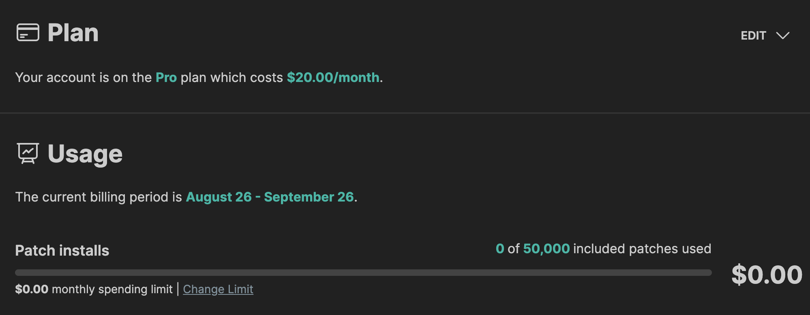
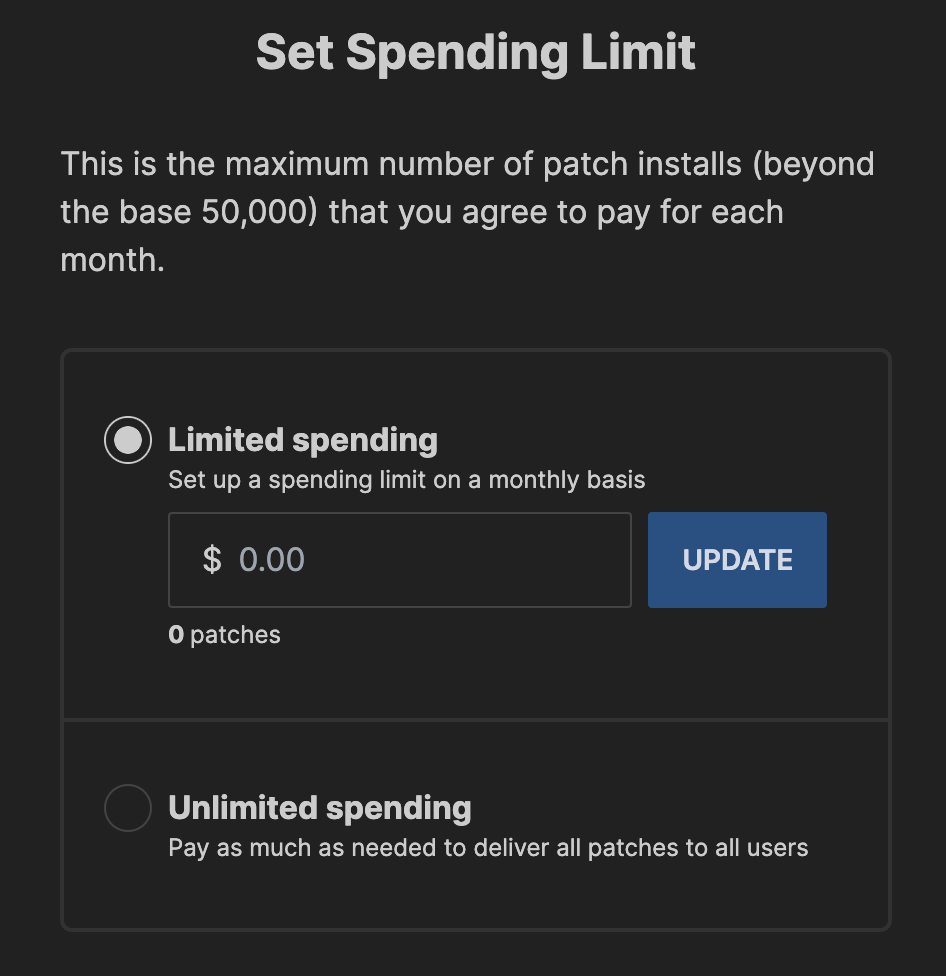

Today we’re announcing simplified pricing for Shorebird. We offer two plans:
**Free** and a new **Pro** plan.

### Free

- Up to 5,000 patch installs per month
- Unlimited Apps
- 1 User

### Pro

- $20 per month
- Includes 50,000 patch installs per month
- Additional installs at $0.0004 per install, with configurable spending limit
- Unlimited Apps
- Unlimited Collaborators

Previously, Shorebird offered a variety of usage tiers. Customers told us this
was confusing and harder to manage for apps with variable updating needs. So
we’ve moved to a single, simpler paid plan to answer this need.

With Pro, your only commitment is to the $20 monthly platform fee, which
includes 50,000 patches delivered. Use as much or as little beyond that as you
want, and only get billed for what you use.

Customers can control their spending limit from the
[Shorebird Console](https://console.shorebird.dev). Your spending limit defaults
to $0 and we will automatically notify you via email once when you’re close to
your limit and again when you’ve reached your limit.

Existing Shorebird customers with “Hobby” or “Teams” will see no changes. You
can keep your plan as it exists today, or you’re welcome to transition to this
new usage-based billing at any time on the
[Shorebird Console](https://console.shorebird.dev).

We made a bunch of improvements behind the scenes to make this happen. If you
have any questions about billing, or would like to purchase Shorebird in a
different way, please don’t hesitate to reach out at contact@shorebird.dev.
