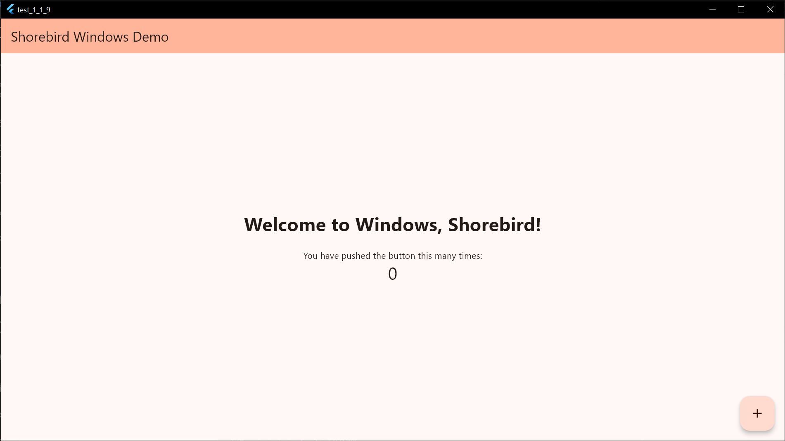

Shorebird now supports updating Flutter apps built for Windows desktop! 🥳



The release and patch flow is the same as iOS, Android and Mac:

```sh
# Creates a new windows release
shorebird release windows
```

```sh
# Patches a windows release
shorebird patch windows --release-version=1.2.3+4
```

Windows support is in beta and only supports Windows x64 at this time. Let us
know if you require Windows arm64 support.

Try this out and let us know what you think. Let us know if you run into any
issues or have ideas for new features by
[creating a new GitHub issue](https://github.com/shorebirdtech/shorebird/issues/new/choose)
