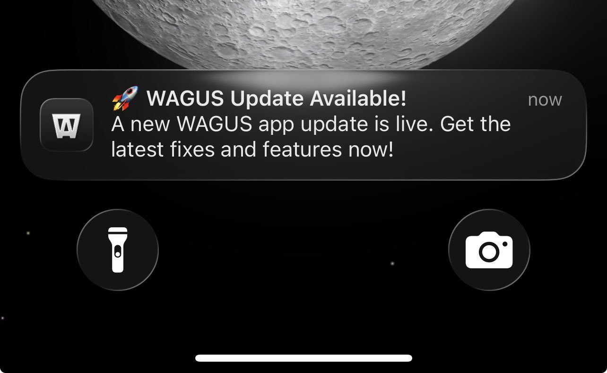

[WAGUS](https://wagus.app/) — short for _We're All Gonna Use Solana_ — is a
Solana-powered mobile platform that blends social chat, gaming, embedded crypto
wallets, and business tools. Designed to accelerate mainstream adoption of
crypto, the app aims to make decentralized finance and communication accessible
and engaging for retail users.

Launched out of the [Colosseum Hackathon](https://www.colosseum.com/hackathon),
WAGUS has quickly grown across Android and iOS thanks to its Flutter
implementation by building a loyal user base eager for updates, new features,
and better UX.

For founder Michael Gallego, success means staying in sync with the
ever-evolving Solana ecosystem.

> Every two hours something could change. We have to respond in real time.
>
> - Michael Gallego, WAGUS Founder

## The Challenge

Before Shorebird, the WAGUS team faced the same problem every mobile app builder
in the fast paced crypto world does: the App Store and Play Store release cycles
just weren’t fast enough compared to how fast the rest of the market moves.

With users actively requesting features, and with the real-time nature of
blockchain data, waiting days for a new release to be approved was a nonstarter.

On top of that, the app's rapid development pace, often driven by AI-generated
agents, meant that every day brought new code that needed testing, tweaking, and
deployment.

## The Shorebird Solution

Shorebird allowed WAGUS to completely rethink how they ship their mobile apps.
By introducing code push, WAGUS could:

- Patch new features and bug fixes in real time
- Avoid app store delays
- Deliver continuous improvements without interrupting users

> We patch fast. One release had 60 patches. Most of them are small
> quality-of-life updates requested by users. With Shorebird, we could ship them
> the same day.
>
> - Michael Gallego, WAGUS Founder

To quickly get these changes into users’ hands, the WAGUS team also integrated
the [Shorebird Code Push package](https://pub.dev/packages/shorebird_code_push).
This enables them to hook into the update flow and display a custom app
notification, letting users know when a new version is ready to install. This
simple addition has enabled faster and more frequent deployments.

_A WAGUS app notification altering a user to an update that is ready to be
installed via Shorebird_

The team found that Shorebird was easy to adopt thanks to its CLI-driven setup
and clear documentation. They now use a three-branch flow (develop → patch →
release) and run patches multiple times per week, sometimes within hours of a
user request.

## The Impact

With Shorebird, the WAGUS team has:

- Delivered 140,000+ lines of Dart code via patches
- Decreased user-requested feature turnaround to a matter of hours
- Created a custom in-app update experience with restart prompts

Their use of AI tools like [Scout](https://scout.new),
[Cline](https://cline.bot), and [Conductor](https://conductor.build) allows
entire feature sets to be generated and shipped rapidly under the guidance of
senior Flutter developers. Their expertise in application architecture and solid
development principles enables fast iteration without sacrificing long-term
scalability. Combined with Shorebird’s real-time deployment, WAGUS is now
shipping mobile updates as fast, and sometimes even faster, than most web apps.

## Looking Ahead

WAGUS is redefining how crypto apps get built and deployed and Shorebird is
helping them do it. For teams building in fast-changing environments,
Shorebird’s code push capabilities aren’t just helpful, they’re critical.

> Shorebird lets us move at the speed of our users.
>
> - Michael Gallego, WAGUS Founder

Follow their journey on [X at @WAGUS_APP](https://x.com/WAGUS_APP), where they
share real-time build updates and engage with their user community.
