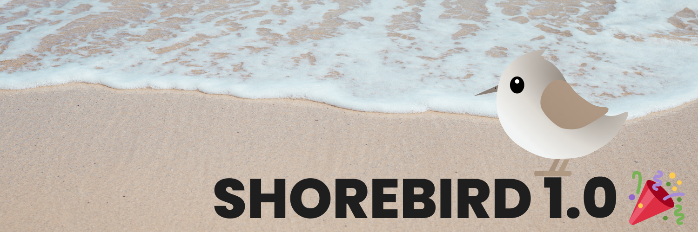

# Shorebird 1.0 🥳

We’re excited to announce Shorebird Code Push 1.0, including stable support for iOS!

## 🐦 What is Shorebird?

Shorebird allows you to update your Flutter apps instantly over the air,
deploying fixes directly to end users' devices. Shorebird can be [integrated into
your app](https://docs.shorebird.dev) in under 5 minutes and requires no code changes. With Shorebird, you
can update any Dart code in your app instantly.

Shorebird is built to comply with
[Apple](https://docs.shorebird.dev/faq#does-shorebird-comply-with-app-store-guidelines)
and
[Google](https://docs.shorebird.dev/faq#does-shorebird-comply-with-play-store-guidelines)
store policies without sacrificing performance (even after patching).

Shorebird is free to use for small apps and offers plans that scale as your app
grows.

## 🚀 Get Started

Get started now with our [Quick Start
Guide](https://docs.shorebird.dev/guides/code_push_quickstart)!

iOS stable requires the latest version of Shorebird CLI (1.0.0) and the latest
stable version of Flutter (3.19.5). Known issues are tracked on our [status page](https://docs.shorebird.dev/status).

Code is available on [GitHub](https://github.com/shorebirdtech/shorebird).

See you on [Discord](https://discord.gg/shorebird) 👋

Your Shorebird Team
