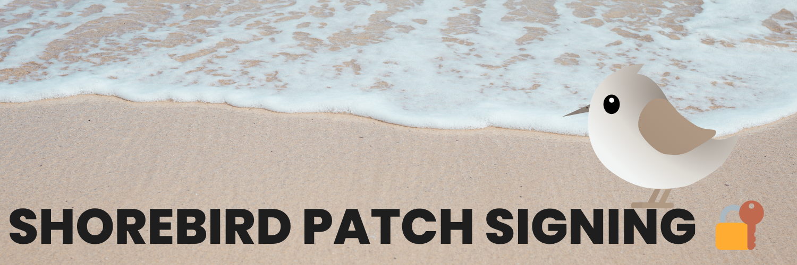

# Patch Signing (beta) 🔒

Shorebird’s code push allows developers to update their Flutter apps instantly,
over the air, deploying fixes directly to end users’ devices. Our solution takes
less than 5 minutes to integrate and requires no code changes. Shorebird’s code
push can update any Dart code in your app and we’ve designed the system to
comply with Apple and Google store policies without sacrificing performance
(even after patching).

One of our goals is that Shorebird should be the default for all Flutter users.
To do that, using Shorebird needs to be a strict upgrade from default Flutter.
This includes ensuring that Shorebird is always helping with the security and
privacy of your application.

Today we're announcing another layer of security for Shorebird: patch signing.
Patch signing allows you to cryptographically sign updates to your app and make
your app require that patch contents are verified (via cryptographic signature)
before applying the patch.

This uses the same signing technologies that are used when distributing your app
through the app stores. With patch signing, your app has the ability to
independently verify patch contents without trusting any system or networks
(including Shorebird) that might have been involved in transporting the patch
from you to your users.

Patch signing is an optional addition to the many ways in which Shorebird
already works to protect the security of all our customers. We always take many
precautions to protect the security of your app, including limiting what data
leaves your servers (we never see or store your source code), securing what data
we do store both via encryption in transit and in rest, cryptographically
hashing and validating the contents of any patch you create, as examples. You
can see a full breakdown of security practices we follow on your behalf in our
[public security policies](https://handbook.shorebird.dev/security).

The patch signing we’ve shipped today is marked as “beta”. The feature is fully
functional, but we expect there to be rough edges in how the patch signing
integrates with your existing developer flows. A system is only as secure as its
weakest link, so improving our integrations with your preferred key management
systems, etc. is where we go next and where we need your help.

We’re looking for companies to work with us in testing and improving patch
signing over the next few weeks. If you are interested, please give it a try:
https://docs.shorebird.dev/guides/patch-signing/ You can also reach out to us
via [GitHub](https://github.com/shorebirdtech/shorebird/),
[Discord](https://discord.gg/shorebird) or [email](contact@shorebird.dev) should
you have feedback or questions.

We’d love to help you integrate Shorebird code push into your application.
Please [reach out](mail:contact@shorebird.dev) to us if you have any questions
or need help getting started.

If you're curious about what we had to change in Dart to make this all possible,
check out our [previous post](how-we-built-code-push).
