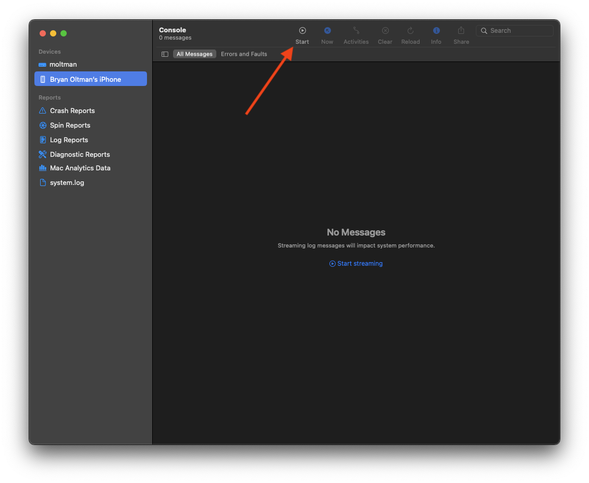
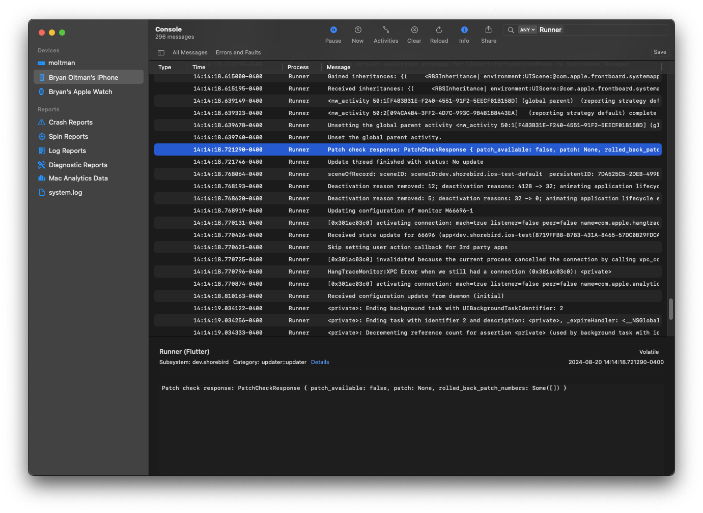

# Viewing logs for your release app

Whether you're using a logging framework or the humble `print` function, logs
provide a window into how your app is working (or not working) in real-time.
Being able to view logs can help you more quickly locate and fix errors than you
would be able to by only observing your app's behavior.

Developers most often see log output while coding an app, but did you know you
can also see logs for release apps without needing to attach a debugger?

## `logcat` for Android

All Android system output can be viewed using the
[`logcat`](https://developer.android.com/tools/logcat) command line tool. You
can try this out by connecting your Android device via USB and running `adb
logcat` in your terminal.

Note: adb will need to be on your path for this to work. If you see an error
like `command not found: adb` or `'adb' is not recognized as an internal or
external command`, you will need to add `adb` to your PATH. StackOverflow has
good answers to help with this for
[macOS/Linux](https://stackoverflow.com/questions/10303639/adb-command-not-found)
and
[Windows](https://stackoverflow.com/questions/20564514/adb-is-not-recognized-as-an-internal-or-external-command-operable-program-or)

Without any filtering, `adb logcat` is _very_ noisy. To show just the output for
your Flutter app, you can filter the output using `adb logcat | grep flutter` on
macOS/Linux or `adb logcat | findstr flutter` on Windows.

## Console.app for iOS

macOS includes a utility app named
[Console](https://support.apple.com/guide/console/welcome/mac) that shows all
system logs.

To open the Console app, type <kbd>⌘</kbd> + <kbd>Space</kbd>, type 'Console',
and press <kbd>Enter</kbd>.

By default, this shows logs for your Mac, but it can also be used to view logs
for your iPhone, iPad, Apple Watch, etc.

To see system logs, connect your device to your Mac via USB, select it in the
left column, and press the "Start" button in the top toolbar.

Without filtering, these logs are _very_ noisy. To filter out logs that are not
from your app, type your app's name in the search bar and press enter (for
Flutter apps, this defaults to "Runner"). You can then right-click on "Runner"
in the Process column and select "Show Process 'Runner'"

With this filter applied, we are only shown logs that apply to our app.

